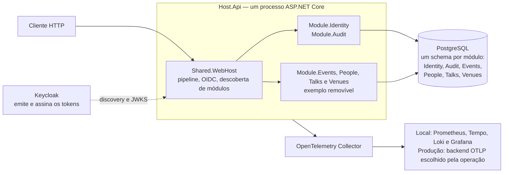
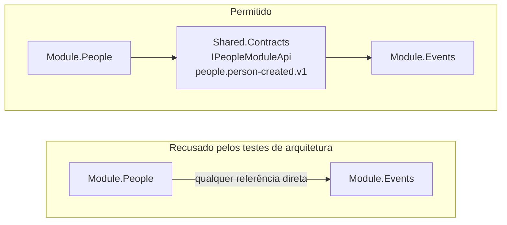
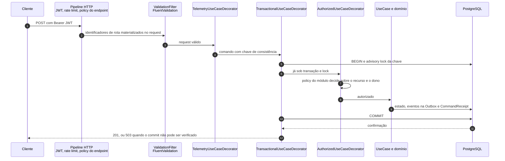
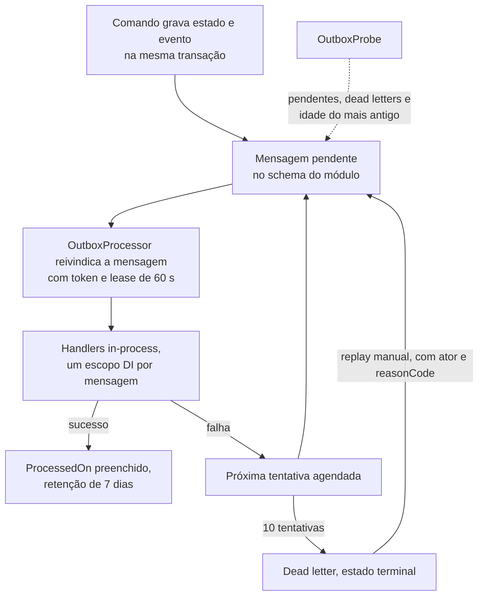

# Modular API Template — .NET 10

Base de API em .NET 10 publicada como código aberto para quem vai começar um serviço e não quer decidir de novo autenticação, auditoria, migrações, concorrência e telemetria. Instala como template do `dotnet new` e gera um projeto independente: a cópia não recebe atualizações futuras deste repositório.

O desenho é um monolito modular. Um processo ASP.NET Core hospeda módulos que não se referenciam entre si, um PostgreSQL guarda um schema por módulo, o Keycloak emite os tokens e a API decide quem pode agir sobre cada recurso. Escrita de negócio entra por uma fronteira transacional com lock no PostgreSQL. O evento vai para a Outbox na mesma transação do estado. Log, métrica e trace saem por uma rota só, sem dado pessoal.

O núcleo não conhece gestão de eventos. Este repositório inclui um exemplo removível para demonstrar concorrência, propriedade de recursos e comunicação entre módulos. **A geração padrão não inclui esse domínio.**

Para o frontend existe um template irmão, com a mesma ideia de regras em Markdown: [react-standards-template](https://github.com/thiagocorreanet/react-standards-template).

## O que já vem resolvido

| Capacidade | Onde mora |
|---|---|
| Autenticação OIDC com Keycloak e identidade interna derivada de `(issuer, subject)` | `Module.Identity` |
| Auditoria append-only por interceptor, com valores mascarados por padrão | `Module.Audit` e `Shared.Data` |
| Fronteira transacional por comando, advisory lock e prova de commit | `Shared.Http` e `Shared.Data` |
| Outbox transacional com claim token, dead letter e replay auditado | `Shared.Messaging` |
| Serilog e OpenTelemetry por uma rota, com sanitização de logs e traces | `Shared.Observability` |
| Testes que recusam dependência entre módulos e tipos com `Repository` no nome | `api/tests/Tests.Architecture` |
| Geração do projeto com e sem o domínio de exemplo | `.template.config` e `scripts/test-template.mjs` |

## Visão geral



Cada módulo expõe uma classe `IModule` com seus endpoints, exatamente um `DbContext` e uma `IModuleAccessPolicy`. A descoberta é por varredura de assembly no `Shared.WebHost`, então remover os módulos de exemplo não exige tocar no núcleo. A API não guarda senha de usuário nem chave de assinatura: valida a assinatura RSA, o issuer, a audience e o prazo do token, e recusa um token válido sem vínculo local ativo.

## Fronteira entre módulos



Um módulo referencia apenas `Shared.*`. Conversa síncrona passa por uma interface de `Shared.Contracts`; conversa assíncrona, por um evento de integração com nome estável `contexto.fato.v1`. Os contratos transportam DTOs. Entidade do EF e `IQueryable` não atravessam essa linha, e um módulo também não chama outro por HTTP dentro do mesmo processo. Não existe FK entre schemas de módulos diferentes.

## Caminho de uma escrita



A ordem importa: o lock é adquirido antes de qualquer leitura, validação de invariante ou decisão de autorização. Toda escrita de negócio é um caso de uso marcado com `[Command("chave")]`, e escritores que compartilham uma invariante declaram a mesma chave, o que serializa essas escritas. É custo deliberado, não desenho para alto throughput.

Uma falha transitória descarta o escopo e repete tudo desde a autorização, com `DbContext` novo (padrão: 3 tentativas). Um caso de uso não pode, portanto, guardar estado entre tentativas nem provocar efeito externo; a intenção vai para a Outbox. Se a confirmação do commit falhar, uma conexão nova procura o `CommandReceipt` gravado na mesma transação. Sem essa prova, a resposta é 503 de resultado indeterminado: a base não declara rollback nem sucesso.

Consultas sem `[Command]` pulam a decoração transacional e rodam no escopo da requisição, mas ainda passam pela policy do módulo.

## Eventos e Outbox



A entrega é pelo menos uma vez e não preserva ordem entre réplicas, então todo consumidor precisa ser idempotente por evento e por consumidor. A auditoria faz isso com a chave do evento e `INSERT ON CONFLICT`. Cada módulo tem sua própria sequência de entregas; `Outbox:MaxConcurrentDeliveries` limita as entregas ativas por processo. Dead letter é terminal: o replay exige administrador, registra ator e `reasonCode`, e nunca acontece sozinho.

## Criar um projeto novo

Requisitos: SDK indicado em `api/global.json`, Docker com Compose, Node.js 22+ e OpenSSL para validações de infraestrutura.

Na pasta deste template:

```bash
dotnet new install .
dotnet new modular-api -n SampleCompany -o ../sample-company-api
cd ../sample-company-api/api
dotnet restore
dotnet test
```

Para incluir a demonstração:

```bash
dotnet new modular-api -n SampleCompany -o ../sample-company-example --includeExample true
```

A geração renomeia a solução, o nome de serviço, namespaces e chave da conexão. Realm/audience/roles são configurações que você deve adaptar ao produto. O script local cria um nome de projeto Compose próprio; as portas padrão ainda precisam ser distintas se executar vários projetos simultaneamente.

Não reutilize `bin/`, `obj/`, `.env`, volumes nem bancos entre projetos. Após o primeiro restore, versione os `packages.lock.json` gerados com o seu projeto.

## Executar o ambiente local

```bash
node scripts/init-local.mjs
docker compose -f compose.local.yaml --profile observability up --build -d
node scripts/bootstrap-local.mjs
node scripts/smoke-oidc.mjs
node scripts/smoke-observability.mjs
```

Aguarde a importação do realm antes do bootstrap. Se o Keycloak ainda não estiver pronto, repita **somente o bootstrap**, não a geração de credenciais. Ele aceita apenas uma base de identidades vazia e nunca reeleva usuários ao reiniciar.

| Serviço | Endereço local |
|---|---|
| API / Scalar de desenvolvimento | http://localhost:5761/scalar |
| Keycloak | http://identity.localhost:8080 |
| Grafana, usuário `operator` | http://localhost:3000 |
| Prometheus | http://localhost:9090 |
| PostgreSQL | `127.0.0.1:55432` |

O Scalar é a interface padrão também nos projetos gerados. A raiz `/` redireciona para `/scalar`; os contratos continuam em `/openapi/v1.json` e `/openapi/v1.yaml`. UI e contratos só são publicados em `Development` com `OpenApi:Enabled=true`. O Swagger UI foi removido.

Para testar operações protegidas, informe no esquema `Bearer` um access token obtido no Keycloak/OIDC, sem o prefixo `Bearer`. Não há token ou segredo pré-preenchido nem persistência de autenticação habilitada. Os assets são servidos localmente; fontes externas, telemetria do fornecedor e o Agent do Scalar ficam desabilitados. A observabilidade da API permanece ativa. A integração segue a [documentação oficial do Scalar](https://scalar.com/products/api-references/integrations/aspnetcore/integration).

As senhas são aleatórias e ficam em `.env` (0600). A conta de demonstração da API é `developer`; a administração inicial do Keycloak usa `bootstrap-admin`. Nunca copie essas contas para produção. Se o navegador não resolver `identity.localhost`, configure esse nome para `127.0.0.1`; não mude apenas a URL do login, porque o issuer precisa permanecer igual.

`init-local.mjs` não sobrescreve credenciais. `.local/` é privado no host e seus arquivos são montados somente para leitura nos containers. As portas locais são vinculadas ao loopback.

O import do realm é inicial: editar realm.json não atualiza automaticamente um realm já existente. Faça mudanças pelo processo administrativo do Keycloak; não apague volumes para aplicar uma alteração.

Se `.env` e o vínculo inicial já existem **nesta versão em inglês**, retome apenas com `docker compose -f compose.local.yaml --profile observability up --build -d`. Não execute init-local nem bootstrap novamente. Um ambiente criado antes da padronização para inglês não é compatível automaticamente: preserve-o e use um projeto/banco novo ou um plano explícito de migração.

Para parar preservando dados:

```bash
docker compose -f compose.local.yaml --profile observability down
```

Não use `down -v` se quiser preservar bancos, históricos e telemetria.

## Estrutura

```text
api/
  src/hosts/Host.Api           composição e comandos operacionais
  src/modules/Module.Identity  vínculo OIDC e acesso local
  src/modules/Module.Audit   consulta administrativa append-only
  src/modules/Module.*           módulos opcionais de negócio
  src/shared/Shared.Contracts    contratos, identidade e eventos
  src/shared/Shared.Http         casos de uso, validação e transação
  src/shared/Shared.Data         EF, auditoria, Outbox e migrações
  src/shared/Shared.Messaging    entrega in-process e processamento
  src/shared/Shared.Observability logs, métricas e traces
  src/shared/Shared.WebHost      composição HTTP e segurança
  tests/                        Unit, Integration, Functional, Architecture
infra/                          configurações locais e produtivas separadas
scripts/                        testes de protocolo, restore e validações
docs/                           decisões, segurança, operação e rastreabilidade
```

Sem dependências diretas entre módulos, repositório genérico, broker obrigatório ou microsserviços. Cada módulo possui seu schema e seu DbContext; EF Core é usado diretamente. A autorização de recurso ocorre dentro da fronteira transacional dos comandos.

## Verificar

```bash
dotnet test api/ModularApi.slnx --nologo -clp:ErrorsOnly
node scripts/check-dependencies.mjs
node scripts/validate-production.mjs --fixture
node scripts/validate-infra.mjs
```

No repositório do template, `node scripts/test-template.mjs` gera e testa projetos com e sem exemplo em uma pasta temporária isolada. Integração e testes funcionais usam PostgreSQL real via Testcontainers.

O pipeline GitHub Actions executa testes com gates de cobertura, auditoria NuGet, validações de configuração, scan de segredos e da imagem, e gera SBOM. O CodeQL analisa o C# e os próprios workflows, e publica o resultado na aba Security. Em pull request, a dependency review recusa dependência vulnerável introduzida naquele diff. O Dependabot abre PR semanal para NuGet, Docker e para as actions pinadas por SHA. Um workflow separado verifica OIDC/telemetria reais da fixture local, host em Production e restore lógico. Não publica nem implanta automaticamente. Consulte [verificações de qualidade](docs/quality-gates.md) para os comandos e limites.

## Documentação e limites

- [Guia de instalação e reutilização em um projeto novo](docs/installation-guide.md)
- [Convenções de idioma e compatibilidade](docs/language-conventions.md)
- [Arquitetura e decisões](docs/architecture.md)
- [Arquitetura aplicada: decidir dentro do monolito modular](docs/architecture-practices.md)
- [Boas práticas de .NET e C# nesta base](docs/dotnet-practices.md)
- [Criar um módulo e adaptar o template](docs/extending.md)
- [Identidade, autorização e privacidade](docs/security.md)
- [Execução, incidentes, backup e produção](docs/runbooks.md)
- [Cobertura do documento original](docs/implementation-status.md), disponível no repositório de origem
- [Revisão técnica da entrega](docs/technical-review.md), disponível no repositório de origem
- [Correções da reavaliação de qualidade](docs/corrections-review.md)
- [Gates de testes, cobertura e release](docs/quality-gates.md)

É uma base implementada e testada, não uma declaração de prontidão universal para produção. Frontend, multi-tenancy, migração de usuários do sistema antigo, SLO/RPO/RTO aprovados, retenção legal, HA do IdP e roteamento de alertas dependem do produto e do ambiente. Essas dependências estão identificadas na matriz; não são tratadas como lacunas encerradas por um teste local.

**Banco novo:** as migrações desta base não são um upgrade suportado da antiga autenticação ASP.NET Identity **nem da versão deste template com nomes em português**. Não aponte o migrador para esses bancos. O migrador recusa históricos em schemas não registrados antes de aplicar qualquer migração; isso é uma proteção, não uma conversão de dados.

## Trabalhar com agentes de IA

As regras do projeto são texto em Markdown, lido por pessoas e por agentes:

| Arquivo | Para quê |
|---|---|
| [`CLAUDE.md`](CLAUDE.md) | contrato de trabalho: invariantes, onde cada código mora, armadilhas da base |
| [`AGENTS.md`](AGENTS.md) | os mesmos invariantes em forma condensada, para outros agentes |
| [`docs/architecture-practices.md`](docs/architecture-practices.md) | onde uma regra mora e quando um padrão novo se justifica |
| [`docs/dotnet-practices.md`](docs/dotnet-practices.md) | o código do dia a dia em .NET e C# |

Ao mudar uma regra, atualize `CLAUDE.md` e `AGENTS.md` na mesma alteração. Os projetos gerados nascem com esses arquivos, então a regra viaja junto com o código.

## Contribuir

Issues e pull requests são bem-vindos. Antes de abrir um PR:

- Rode `cd api && dotnet test`. Integração e testes funcionais sobem PostgreSQL real por Testcontainers, então o Docker precisa estar disponível.
- Leia os invariantes de [`CLAUDE.md`](CLAUDE.md). Quebrar um deles é defeito, não preferência de estilo, e `Tests.Architecture` recusa dependência entre módulos e repositório genérico.
- Respeite o idioma: identificador, rota, JSON, evento e código de erro em inglês; mensagem para pessoa, comentário e documentação em pt-BR.
- Dependência nova entra em `api/Directory.Packages.props`, com `PackageReference` sem versão, e exige `packages.lock.json` atualizado, porque o CI roda `--locked-mode`.
- Padrão novo (broker, repositório, outro processo) exige uma ADR em [`docs/architecture.md`](docs/architecture.md) com driver concreto.
- Se a alteração toca o template, rode `node scripts/test-template.mjs`, que gera e testa os dois modos em uma pasta temporária.

Relate falha de segurança em contato privado com o mantenedor, não em issue pública.

## Licença

MIT. Veja [LICENSE](LICENSE). O template inclui configuração para Keycloak, PostgreSQL, Grafana e outros componentes de terceiros, cada um com a sua própria licença.
