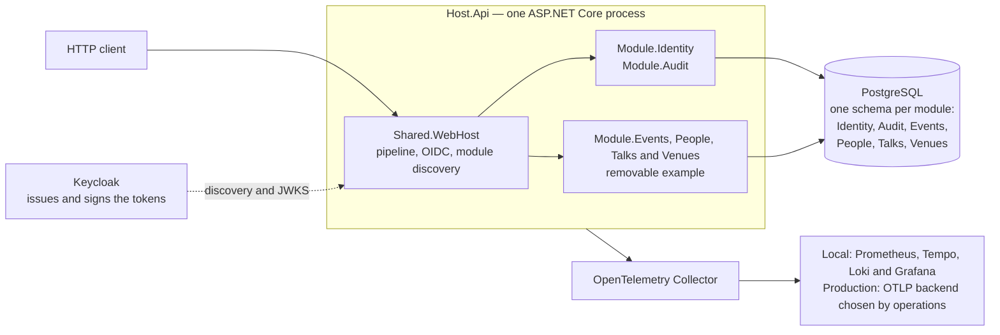
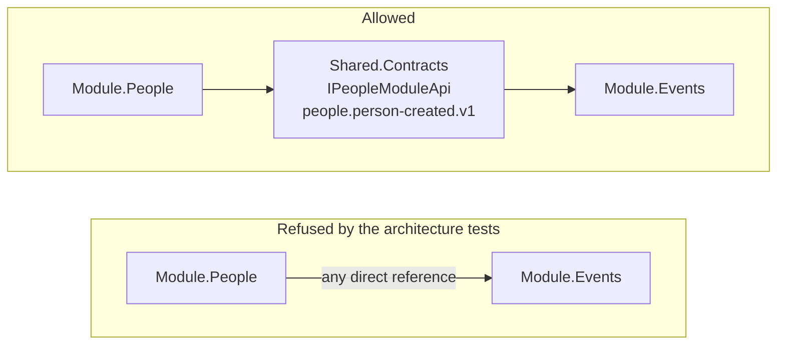
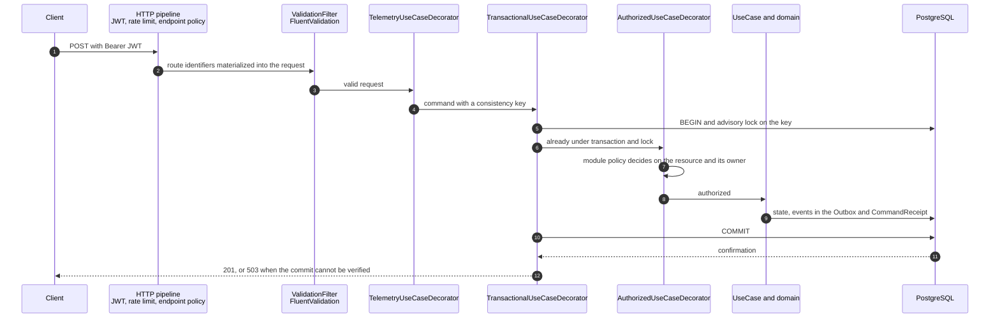
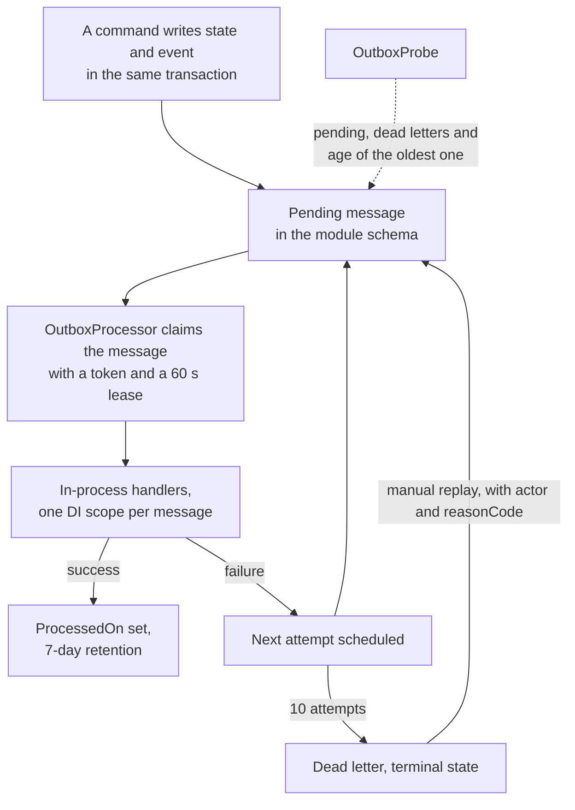

# Modular API Template — .NET 10

A .NET 10 API base, published as open source for anyone starting a service who would rather not decide authentication, auditing, migrations, concurrency and telemetry all over again. It installs as a `dotnet new` template and generates an independent project: the copy gets no later updates from this repository.

The design is a modular monolith. One ASP.NET Core process hosts modules that do not reference each other, one PostgreSQL holds one schema per module, Keycloak issues the tokens and the API decides who may act on each resource. A business write enters through a transactional boundary with a PostgreSQL lock. The event goes to the Outbox in the same transaction as the state. Logs, metrics and traces leave through a single route, with no personal data.

The core knows nothing about event management. This repository ships a removable example that demonstrates concurrency, resource ownership and module-to-module communication. **The default generation does not include that domain.**

There is a sibling template for the frontend, built on the same idea of rules written in Markdown: [react-standards-template](https://github.com/thiagocorreanet/react-standards-template).

## What is already solved

| Capability | Where it lives |
|---|---|
| OIDC authentication with Keycloak and an internal identity derived from `(issuer, subject)` | `Module.Identity` |
| Append-only auditing through an interceptor, with values masked by default | `Module.Audit` and `Shared.Data` |
| Transactional boundary per command, advisory lock and proof of commit | `Shared.Http` and `Shared.Data` |
| Transactional Outbox with claim token, dead letter and audited replay | `Shared.Messaging` |
| Serilog and OpenTelemetry through one route, with log and trace sanitization | `Shared.Observability` |
| Tests that refuse dependencies between modules and types named `Repository` | `api/tests/Tests.Architecture` |
| Project generation with and without the example domain | `.template.config` and `scripts/test-template.mjs` |

## Overview



Each module exposes an `IModule` class with its endpoints, exactly one `DbContext` and one `IModuleAccessPolicy`. Discovery is assembly scanning in `Shared.WebHost`, so removing the example modules takes no change to the core. The API stores no user password and no signing key: it validates the RSA signature, the issuer, the audience and the token lifetime, and refuses a valid token that has no active local binding.

## Module boundary



A module references only `Shared.*`. Synchronous conversation goes through an interface in `Shared.Contracts`; asynchronous conversation goes through an integration event with a stable `context.fact.v1` name. Contracts carry DTOs. EF entities and `IQueryable` do not cross that line, and one module does not call another over HTTP inside the same process. There is no FK between schemas of different modules.

## The path of a write



The order matters: the lock is taken before any read, invariant check or authorization decision. Every business write is a use case marked with `[Command("key")]`, and writers that share an invariant declare the same key, which serializes those writes. That is a deliberate cost, not a design for high throughput.

A transient failure drops the scope and repeats everything from authorization on, with a fresh `DbContext` (3 attempts by default). A use case therefore cannot hold state between attempts or cause an external effect; the intent goes to the Outbox instead. If the commit confirmation fails, a new connection looks for the `CommandReceipt` written in the same transaction. Without that proof the answer is 503, an indeterminate result: the base declares neither rollback nor success.

Queries without `[Command]` skip the transactional decoration and run in the request scope, but they still go through the module policy.

## Events and Outbox



Delivery is at least once and preserves no order across replicas, so every consumer has to be idempotent per event and per consumer. Auditing does that with the event key and `INSERT ON CONFLICT`. Each module has its own delivery sequence; `Outbox:MaxConcurrentDeliveries` caps the active deliveries per process. Dead letter is terminal: replay takes an administrator, records the actor and a `reasonCode`, and never happens on its own.

## Create a new project

Requirements: the SDK pinned in `api/global.json`, Docker with Compose, Node.js 22+ and OpenSSL for the infrastructure validations.

From this template's folder:

```bash
dotnet new install .
dotnet new modular-api -n SampleCompany -o ../sample-company-api
cd ../sample-company-api/api
dotnet restore
dotnet test
```

To include the demonstration:

```bash
dotnet new modular-api -n SampleCompany -o ../sample-company-example --includeExample true
```

Generation renames the solution, the service name, the namespaces and the connection key. Realm, audience and roles are settings you adapt to your product. The local script creates its own Compose project name; the default ports still have to differ if you run several projects at the same time.

Do not reuse `bin/`, `obj/`, `.env`, volumes or databases across projects. After the first restore, commit the generated `packages.lock.json` files with your project.

## Run the local environment

```bash
node scripts/init-local.mjs
docker compose -f compose.local.yaml --profile observability up --build -d
node scripts/bootstrap-local.mjs
node scripts/smoke-oidc.mjs
node scripts/smoke-observability.mjs
```

Wait for the realm import before the bootstrap. If Keycloak is not ready yet, repeat **only the bootstrap**, not the credential generation. It accepts an empty identity base only, and never re-elevates users on restart.

| Service | Local address |
|---|---|
| API / development Scalar | http://localhost:5761/scalar |
| Keycloak | http://identity.localhost:8080 |
| Grafana, user `operator` | http://localhost:3000 |
| Prometheus | http://localhost:9090 |
| PostgreSQL | `127.0.0.1:55432` |

Scalar is the default interface in generated projects too. The root `/` redirects to `/scalar`; the contracts stay at `/openapi/v1.json` and `/openapi/v1.yaml`. UI and contracts are published only in `Development` with `OpenApi:Enabled=true`. Swagger UI was removed.

To exercise protected operations, put an access token obtained from Keycloak/OIDC into the `Bearer` scheme, without the `Bearer` prefix. There is no pre-filled token or secret, and authentication persistence is off. Assets are served locally; external fonts, vendor telemetry and the Scalar Agent are disabled. API observability stays on. The integration follows the [official Scalar documentation](https://scalar.com/products/api-references/integrations/aspnetcore/integration).

Passwords are random and live in `.env` (0600). The API demo account is `developer`; the initial Keycloak administration uses `bootstrap-admin`. Never copy those accounts to production. If your browser does not resolve `identity.localhost`, point that name at `127.0.0.1`; do not change only the login URL, because the issuer has to stay the same.

`init-local.mjs` does not overwrite credentials. `.local/` is private on the host and its files are mounted read-only into the containers. Local ports are bound to the loopback.

The realm import is initial: editing realm.json does not update an existing realm. Make changes through Keycloak's administrative process, and do not delete volumes to apply one.

If `.env` and the initial binding already exist **in this English version**, resume with `docker compose -f compose.local.yaml --profile observability up --build -d` alone. Do not run init-local or bootstrap again. An environment created before the move to English is not automatically compatible: keep it and use a new project and database, or an explicit migration plan.

To stop while preserving data:

```bash
docker compose -f compose.local.yaml --profile observability down
```

Do not use `down -v` if you want to keep databases, history and telemetry.

## Structure

```text
api/
  src/hosts/Host.Api           composition and operational commands
  src/modules/Module.Identity  OIDC binding and local access
  src/modules/Module.Audit     append-only administrative query
  src/modules/Module.*         optional business modules
  src/shared/Shared.Contracts  contracts, identity and events
  src/shared/Shared.Http       use cases, validation and transaction
  src/shared/Shared.Data       EF, auditing, Outbox and migrations
  src/shared/Shared.Messaging  in-process delivery and processing
  src/shared/Shared.Observability logs, metrics and traces
  src/shared/Shared.WebHost    HTTP composition and security
  tests/                       Unit, Integration, Functional, Architecture
infra/                         local and production configuration, kept apart
scripts/                       protocol tests, restore and validations
docs/                          decisions, security, operation and traceability
```

No direct dependencies between modules, no generic repository, no mandatory broker, no microservices. Each module owns its schema and its DbContext; EF Core is used directly. Resource authorization happens inside the transactional boundary of the commands.

## Verify

```bash
dotnet test api/ModularApi.slnx --nologo -clp:ErrorsOnly
node scripts/check-dependencies.mjs
node scripts/validate-production.mjs --fixture
node scripts/validate-infra.mjs
```

In the template repository, `node scripts/test-template.mjs` generates and tests projects with and without the example, in an isolated temporary folder. Integration and functional tests use a real PostgreSQL through Testcontainers.

The GitHub Actions pipeline runs the tests with coverage gates, the NuGet audit, the configuration validations, secret and image scanning, and produces an SBOM. CodeQL analyzes the C# and the workflows themselves, and publishes the result in the Security tab. On pull requests, dependency review refuses a vulnerable dependency introduced by that diff. Dependabot opens a weekly PR for NuGet, Docker and for the SHA-pinned actions. A separate workflow checks real OIDC and telemetry against the local fixture, the host in Production and a logical restore. Nothing is published or deployed automatically. See [quality gates](docs/quality-gates.md) for the commands and their limits.

## Documentation and limits

The documents below are written in pt-BR, as are the human-facing messages in the code.

- [Installation and reuse in a new project](docs/installation-guide.md)
- [Language conventions and compatibility](docs/language-conventions.md)
- [Architecture and decisions](docs/architecture.md)
- [Applied architecture: deciding inside the modular monolith](docs/architecture-practices.md)
- [.NET and C# practices in this base](docs/dotnet-practices.md)
- [Creating a module and adapting the template](docs/extending.md)
- [Identity, authorization and privacy](docs/security.md)
- [Running, incidents, backup and production](docs/runbooks.md)
- [Coverage of the original document](docs/implementation-status.md), available in the source repository
- [Technical review of the delivery](docs/technical-review.md), available in the source repository
- [Corrections from the quality re-assessment](docs/corrections-review.md)
- [Test, coverage and release gates](docs/quality-gates.md)

This is an implemented and tested base, not a claim of universal production readiness. Frontend, multi-tenancy, migrating users from an older system, approved SLO/RPO/RTO, legal retention, IdP high availability and alert routing depend on the product and the environment. Those dependencies are identified in the matrix; they are not treated as gaps closed by a local test.

**New database:** the migrations in this base are not a supported upgrade from the old ASP.NET Identity authentication **or from the version of this template with Portuguese names**. Do not point the migrator at those databases. The migrator refuses histories in unregistered schemas before applying any migration; that is a protection, not a data conversion.

## Working with AI agents

The project rules are text in Markdown, read by people and by agents:

| File | What for |
|---|---|
| [`CLAUDE.md`](CLAUDE.md) | the working contract: invariants, where each piece of code lives, the traps in this base |
| [`AGENTS.md`](AGENTS.md) | the same invariants in condensed form, for other agents |
| [`docs/architecture-practices.md`](docs/architecture-practices.md) | where a rule lives and when a new pattern is justified |
| [`docs/dotnet-practices.md`](docs/dotnet-practices.md) | the day-to-day .NET and C# code |

When you change a rule, update `CLAUDE.md` and `AGENTS.md` in the same change. Generated projects are born with these files, so the rule travels with the code.

## Contributing

Issues and pull requests are welcome. Before opening a PR:

- Run `cd api && dotnet test`. Integration and functional tests start a real PostgreSQL through Testcontainers, so Docker has to be available.
- Read the invariants in [`CLAUDE.md`](CLAUDE.md). Breaking one is a defect, not a matter of style, and `Tests.Architecture` refuses dependencies between modules and generic repositories.
- Keep the language split: identifiers, routes, JSON, events and error codes in English; human-facing messages, comments and documentation in pt-BR, with this README in English.
- A new dependency goes into `api/Directory.Packages.props`, with a `PackageReference` carrying no version, and requires updated `packages.lock.json` files, because CI runs `--locked-mode`.
- A new pattern (broker, repository, another process) requires an ADR in [`docs/architecture.md`](docs/architecture.md) with a concrete driver.
- If the change touches the template, run `node scripts/test-template.mjs`, which generates and tests both modes in a temporary folder.

Report a security flaw privately to the maintainer, not in a public issue.

## License

MIT. See [LICENSE](LICENSE). The template ships configuration for Keycloak, PostgreSQL, Grafana and other third-party components, each under its own license.
