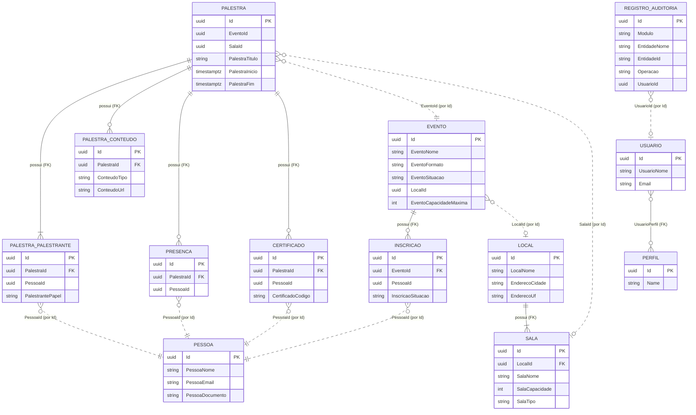

# Regras de negócio — mapa do domínio

Um arquivo por módulo, com regras numeradas (`RN-<MOD>-NNN`), invariantes do agregado e os códigos de erro correspondentes (`Modulo.Motivo`, que aparecem em `codigo` no ProblemDetails). O módulo **Locais** está implementado; os demais seguem [`../spec/api-endpoints.md`](../spec/api-endpoints.md), que é o contrato.

| Módulo | Arquivo | Prefixo das regras | Agregados |
|---|---|---|---|
| Locais | [locais.md](locais.md) | `RN-LOC` | Local (com Salas) |
| Pessoas | [pessoas.md](pessoas.md) | `RN-PES` | Pessoa |
| Eventos | [eventos.md](eventos.md) | `RN-EVT` | Evento (com Inscrições) |
| Palestras | [palestras.md](palestras.md) | `RN-PAL` | Palestra (com Palestrantes, Conteúdos, Presenças, Certificados) |
| Identidade | [identidade.md](identidade.md) | `RN-IDT` | Usuário, Perfil |
| Auditoria | [auditoria.md](auditoria.md) | `RN-AUD` | Registro de auditoria |

## Diagrama simplificado

Relacionamentos **dentro** de um módulo são chaves estrangeiras reais (linha contínua). Relacionamentos **entre** módulos são apenas `Guid` (linha tracejada): não existe FK cruzando schemas; a existência é validada em tempo de escrita pelas Module APIs, e a exclusão do lado "pai" não cascateia (ver regras de cada módulo).

## Regras transversais (valem para todos os módulos)

| Código | Regra | Onde é garantida |
|---|---|---|
| RN-GER-001 | Toda entidade principal tem `CriadoEm/Por`, `AlteradoEm/Por`, `ExcluidoEm/Por`, `EstaAtivo`, preenchidos automaticamente. | `AuditoriaSaveChangesInterceptor` |
| RN-GER-002 | Exclusão é lógica: o registro some das consultas mas permanece no banco. | interceptor + filtro `SoftDelete` |
| RN-GER-003 | Toda inclusão, alteração e exclusão gera um registro de auditoria com usuário e `traceId`. | `EntidadeAlterada` → módulo Auditoria |
| RN-GER-004 | Unicidade de negócio considera apenas registros não excluídos. | índices filtrados por `"ExcluidoEm" IS NULL` |
| RN-GER-005 | Um módulo nunca lê tabelas de outro; dados de outro módulo vêm por `I<X>ModuleApi` ou eventos. | arquitetura (ADR 0003) |
| RN-GER-006 | Referências entre módulos não impedem a exclusão do referenciado; cada módulo decide como reagir (evento de exclusão ou validação em leitura). | eventos `*Excluido` |
| RN-GER-007 | Escrita exige perfil `Administrador` ou `Organizador`; leitura exige autenticação; exceções explícitas por endpoint. | `Politicas.Gestao`, `MapModuleGroup` |
| RN-GER-008 | Listagens são paginadas (máx. 100 por página) e ordenadas de forma determinística. | `PagedRequest`, validators |
| RN-GER-009 | Datas são armazenadas em UTC (`timestamptz`) e trafegam como ISO-8601 com offset. | convenções do `ModuleDbContext` |
