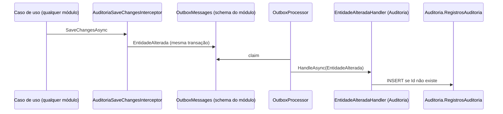

# Regras de negócio — Auditoria

Módulo em implementação; fonte: [`../spec/api-endpoints.md`](../spec/api-endpoints.md) e código de `Shared.Data.Interceptors.AuditoriaSaveChangesInterceptor` (origem dos dados). Rota `api/v1/auditoria`, schema `Auditoria`, tabela `RegistrosAuditoria`.

## Entidade

**RegistroAuditoria** — imutável, **não** herda `EntidadeBase`: `Id` (= `Id` do evento `EntidadeAlterada`), `Modulo`, `EntidadeNome`, `EntidadeId`, `Operacao` (`Inclusao` | `Alteracao` | `Exclusao`), `DadosAnteriores?` (jsonb), `DadosNovos?` (jsonb), `UsuarioId?`, `UsuarioNome?`, `TraceId?`, `OcorridoEm` (momento da alteração), `RegistradoEm` (momento da persistência do registro).

## Regras

| Código | Regra | Onde |
|---|---|---|
| RN-AUD-001 | Toda inclusão, alteração ou exclusão lógica de entidade em qualquer módulo com `AuditChangesEnabled` gera exatamente um `EntidadeAlterada` por entidade por `SaveChanges`. | `AuditoriaSaveChangesInterceptor` |
| RN-AUD-002 | `Inclusao` registra todas as propriedades em `DadosNovos`; `Alteracao`/`Exclusao` registram apenas as propriedades modificadas, com valor anterior e atual. | interceptor (`CriarRegistroAuditoria`) |
| RN-AUD-003 | Uma alteração que preenche `ExcluidoEm` é classificada como `Exclusao`. | interceptor |
| RN-AUD-004 | O usuário registrado é o autenticado no request (`ICurrentUser.Id`, `Nome ?? Email`); fora de request (jobs, seed) o nome é `"sistema"`. | interceptor |
| RN-AUD-005 | O registro carrega o `TraceId` do request de origem, permitindo ligar auditoria, logs e traces. | interceptor + `OutboxMessage.TraceParent` |
| RN-AUD-006 | A trilha é gravada de forma atômica com o negócio (Outbox na mesma transação) e persistida de forma assíncrona pelo handler do módulo. | `OutboxProcessor` → `EntidadeAlteradaHandler` |
| RN-AUD-007 | O handler é idempotente: o `Id` do evento é a PK do registro; reentrega não duplica. | `EntidadeAlteradaHandler` |
| RN-AUD-008 | O módulo Auditoria **não audita a si mesmo** (`AuditoriaDbContext.AuditChangesEnabled => false`). | `AuditoriaDbContext` |
| RN-AUD-009 | Registros são imutáveis: não há endpoints de alteração ou exclusão; correções são novos fatos nos módulos de origem. | ausência de endpoints de escrita |
| RN-AUD-010 | Consulta exige `Administracao`; filtros por módulo, entidade, id, usuário, operação e período; ordenação por `OcorridoEm` desc. | endpoints |
| RN-AUD-011 | `DadosAnteriores`/`DadosNovos` podem conter dados pessoais; retenção e anonimização seguem política a definir (LGPD). | governança |

## Fluxo

## Índices

`(Modulo, EntidadeNome, EntidadeId)` para histórico de um registro; `OcorridoEm` para períodos; `UsuarioId` para "o que este usuário fez".

## Endpoints

| Método | Rota | Política |
|---|---|---|
| GET | `/api/v1/auditoria/registros` | Administracao |
| GET | `/api/v1/auditoria/registros/{id}` | Administracao |
