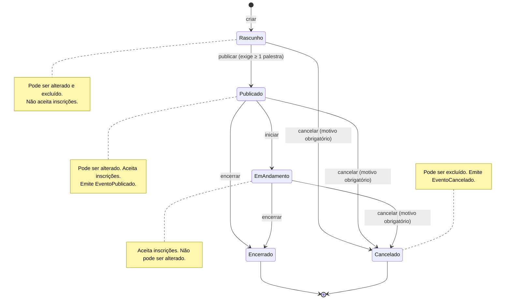

# Regras de negócio — Eventos

Módulo em implementação; fonte: [`../spec/api-endpoints.md`](../spec/api-endpoints.md). Rota `api/v1/eventos`, schema `Eventos`, tabelas `Eventos` e `Inscricoes`.

## Agregado

**Evento** (raiz) com coleções de **Inscrições** e **Trilhas**. Campos: `EventoNome`, `EventoDescricao?` (4000), `EventoDataInicio`, `EventoDataFim`, `EventoFormato` (`Presencial` | `Remoto` | `Hibrido`), `LocalId?`, `EventoLinkRemoto?`, `EventoSituacao` (`Rascunho` | `Publicado` | `EmAndamento` | `Encerrado` | `Cancelado`), `EventoCapacidadeMaxima?`, `EventoCancelamentoMotivo?`.

**Inscrição**: `EventoId`, `PessoaId`, `InscricaoSituacao` (`Confirmada` | `Cancelada`), `InscricaoRealizadaEm`, `InscricaoCanceladaEm?`. Índice único `(EventoId, PessoaId)` filtrado por `InscricaoSituacao = 'Confirmada'`.

## Máquina de estados do Evento

Qualquer transição fora das setas acima → `422 Eventos.TransicaoSituacaoInvalida`.

## Regras

| Código | Regra | Erro |
|---|---|---|
| RN-EVT-001 | `EventoDataFim` é posterior a `EventoDataInicio`. | `400 Validacao` |
| RN-EVT-002 | Evento `Presencial` exige `localId` de um local existente (`ILocaisModuleApi.ObterLocalResumoAsync`). | `422 Eventos.LocalNaoEncontrado` |
| RN-EVT-003 | Evento `Remoto` exige `eventoLinkRemoto` e **não** pode ter `localId`. | `422 Eventos.FormatoInconsistente` |
| RN-EVT-004 | Evento `Hibrido` exige `localId` existente **e** `eventoLinkRemoto`. | `422 Eventos.FormatoInconsistente` / `LocalNaoEncontrado` |
| RN-EVT-005 | Todo evento nasce em `Rascunho`. | — |
| RN-EVT-006 | Publicar exige ao menos uma palestra ativa (`IPalestrasModuleApi.ContarPalestrasDoEventoAsync > 0`) e emite `EventoPublicado`. | `422 Eventos.EventoSemPalestras` |
| RN-EVT-007 | Cancelar exige `motivo` (gravado em `EventoCancelamentoMotivo`) e emite `EventoCancelado`. | `422 Eventos.MotivoCancelamentoObrigatorio` |
| RN-EVT-008 | Transições permitidas: Rascunho→Publicado; Publicado→EmAndamento; Publicado ou EmAndamento→Encerrado; Rascunho, Publicado ou EmAndamento→Cancelado. | `422 Eventos.TransicaoSituacaoInvalida` |
| RN-EVT-009 | Alterar dados do evento só em `Rascunho` ou `Publicado`. | `422 Eventos.EventoNaoPodeSerAlterado` |
| RN-EVT-010 | Excluir (lógico) só em `Rascunho` ou `Cancelado`. | `422 Eventos.EventoNaoPodeSerExcluido` |
| RN-EVT-011 | Inscrição só em evento `Publicado` ou `EmAndamento`. | `422 Eventos.EventoNaoAceitaInscricoes` |
| RN-EVT-012 | A pessoa inscrita deve existir e estar ativa (`IPessoasModuleApi`). | `422 Eventos.PessoaNaoEncontrada` |
| RN-EVT-013 | Uma pessoa tem no máximo uma inscrição **confirmada** por evento; pode se reinscrever após cancelar. | `409 Eventos.PessoaJaInscrita` |
| RN-EVT-014 | Capacidade: `EventoCapacidadeMaxima`; se nula e há local, `LocalCapacidadeTotal` do `LocalResumo`; se nula e sem local (remoto), ilimitada. Inscrições confirmadas ≥ capacidade → recusa. | `422 Eventos.CapacidadeEsgotada` |
| RN-EVT-015 | Inscrever emite `InscricaoRealizada`; cancelar inscrição muda a situação para `Cancelada` (não é soft delete), grava `InscricaoCanceladaEm` e emite `InscricaoCancelada`. | `404 Eventos.InscricaoNaoEncontrada`, `422 Eventos.InscricaoJaCancelada` |
| RN-EVT-016 | Inscrever e cancelar inscrição exigem apenas autenticação (participante pode se inscrever); demais escritas exigem `Gestao`. | `401`/`403` |
| RN-EVT-017 | Listagem ordenada por `EventoDataInicio` desc, com filtros de busca, situação, formato e faixa de data de início. | — |
| RN-EVT-018 | O detalhe do evento inclui `localNome` (via `ILocaisModuleApi`) e `inscricoesConfirmadas` (contagem). | `404 Eventos.EventoNaoEncontrado` |
| RN-EVT-019 | O nome de uma pessoa na listagem de inscrições vem de `IPessoasModuleApi.ObterPessoasResumoAsync` em lote (nunca copiado para o schema Eventos). | — |
| RN-EVT-020 | Todo evento mantém ao menos uma trilha. Quando `trilhas` é omitido na criação, nasce a `Trilha única`. | `422 Eventos.EventoPrecisaDeUmaTrilha` |
| RN-EVT-021 | Nome de trilha é único por evento, sem diferenciar caixa; cor usa `#RRGGBB`. | `409 Eventos.TrilhaNomeDuplicado` / `400 Validacao` |
| RN-EVT-022 | Trilhas podem ser alteradas, inativadas e excluídas logicamente; inativas não recebem novas palestras. | `404 Eventos.TrilhaNaoEncontrada` |

## Invariantes do agregado

1. Consistência formato ↔ local ↔ link (RN-EVT-002..004) em toda criação e alteração.
2. `EventoSituacao` só muda pelo método de transição do agregado, que valida a tabela de transições.
3. Inscrições confirmadas ≤ capacidade efetiva no momento da inscrição (verificação no caso de uso; o índice único protege duplicidade, não capacidade, portanto em concorrência extrema pode haver excesso de uma unidade; aceito).
4. `EventoCancelamentoMotivo` preenchido se e somente se `Cancelado`.

## Contrato oferecido (`IEventosModuleApi`)

| Método | Retorno |
|---|---|
| `ObterEventoResumoAsync(eventoId)` | `EventoResumo(Id, EventoNome, EventoDataInicio, EventoDataFim, EventoFormato, EventoSituacao, LocalId)` (formato/situação como texto) ou `null` |
| `InscricaoConfirmadaExisteAsync(eventoId, pessoaId)` | `bool` |
| `ObterTrilhaResumoAsync(eventoId, trilhaId)` | `TrilhaResumo(Id, EventoId, TrilhaNome, EstaAtivo)` ou `null` |

Eventos publicados: `EventoPublicado`, `EventoCancelado`, `InscricaoRealizada`, `InscricaoCancelada`.

## Endpoints

| Método | Rota | Política |
|---|---|---|
| POST | `/api/v1/eventos` | Gestao |
| PUT | `/api/v1/eventos/{id}` | Gestao |
| PATCH | `/api/v1/eventos/{id}/situacao` | Gestao |
| DELETE | `/api/v1/eventos/{id}` | Gestao |
| GET | `/api/v1/eventos/{id}` | autenticado |
| GET | `/api/v1/eventos` | autenticado |
| POST | `/api/v1/eventos/{id}/inscricoes` | autenticado |
| DELETE | `/api/v1/eventos/{id}/inscricoes/{inscricaoId}` | autenticado |
| GET | `/api/v1/eventos/{id}/inscricoes` | autenticado |
| GET/POST | `/api/v1/eventos/{id}/trilhas` | autenticado / Gestao |
| PUT/DELETE | `/api/v1/eventos/{id}/trilhas/{trilhaId}` | Gestao |
