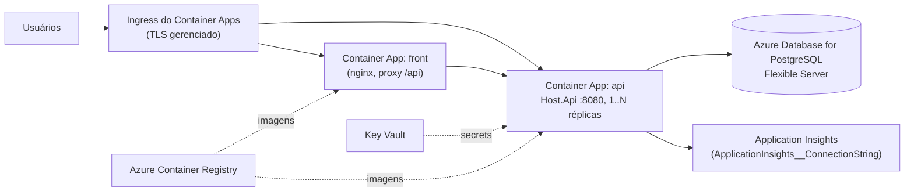

# Runbook — Deploy no Azure

Objetivo: rodar a **mesma imagem** do `Host.Api` (e do front) no Azure com PostgreSQL gerenciado e Application Insights, sem alterar código (ADR 0012).

## Topologia recomendada



Alternativa com **App Service for Containers** (Linux): mesmas variáveis; o App Service expõe a porta definida em `WEBSITES_PORT=8080`.

## Recursos

| Recurso | Observações |
|---|---|
| Resource Group | um por ambiente (`rg-gestao-eventos-prd`) |
| Azure Container Registry | destino do `docker build`/`push` do pipeline |
| Azure Database for PostgreSQL Flexible Server | versão 17; banco `gestao_eventos`; usuário da aplicação com `CREATE` no banco (para schemas/migrações) ou, com migrações em pipeline, apenas DML nos schemas existentes; SSL obrigatório (`SSL Mode=Require`) |
| Container Apps Environment + Log Analytics | logs de stdout (JSON compacto do Serilog) já caem no Log Analytics |
| Application Insights (workspace-based) | connection string vai para a API |
| Key Vault | `Jwt--SigningKey`, connection string, senha inicial do admin; referenciados como secrets do Container App |
| Managed Identity | para o Container App puxar imagens do ACR e ler o Key Vault |

## Variáveis de ambiente da API

```
ASPNETCORE_ENVIRONMENT=Production
ConnectionStrings__GestaoEventos=Host=<server>.postgres.database.azure.com;Port=5432;Database=gestao_eventos;Username=<user>;Password=<secret>;SSL Mode=Require;Maximum Pool Size=100
Database__MigrateOnStartup=false                 # migrações em pipeline (abaixo); true apenas em ambientes de teste
Jwt__SigningKey=<secret ≥ 32 chars>
Jwt__Issuer=gestao-eventos
Jwt__Audience=gestao-eventos
Identidade__AdministradorInicial__Email=<email>
Identidade__AdministradorInicial__Nome=Administrador
Identidade__AdministradorInicial__Senha=<secret, só na primeira subida>
Cors__AllowedOrigins__0=https://<dominio-do-front>
RateLimiting__PermitLimit=300
RateLimiting__WindowSeconds=60
Outbox__Enabled=true
ApplicationInsights__ConnectionString=<connection string do App Insights>
# OTEL_EXPORTER_OTLP_ENDPOINT: deixe vazio no Azure, ou aponte para um Collector se houver Grafana
```

Container Apps: ingress externo na porta 8080 para a API (ou interno, se só o front a acessa), probes `GET /health/live` (liveness) e `GET /health/ready` (readiness), mínimo 1 réplica (o `OutboxProcessor` roda dentro da API; com 0 réplicas o Outbox para), escala por HTTP concurrency ou CPU. O `UseForwardedHeaders` já trata o `X-Forwarded-Proto` do ingress.

## Pipeline (GitHub Actions / Azure DevOps), etapas

1. `dotnet test api/GestaoEventos.slnx` (Testcontainers requer runner com Docker).
2. `docker build -f api/src/hosts/Host.Api/Dockerfile -t <acr>/gestao-eventos-api:<sha> api/` e `docker build -t <acr>/gestao-eventos-front:<sha> front/`; `push`.
3. **Migrações** (job com acesso à rede do banco; `dotnet-ef` instalado): gerar script idempotente por módulo e aplicar com `psql`, ou rodar um job de container efêmero da própria imagem com `Database__MigrateOnStartup=true` e `Outbox__Enabled=false` que encerra após migrar (ver [migracoes-banco.md](migracoes-banco.md)). Aprovação manual antes desta etapa em produção (revisão por par).
4. `az containerapp update --image <acr>/gestao-eventos-api:<sha>` (e o front). Revisões do Container Apps permitem rollback imediato para a revisão anterior.
5. Smoke test: `GET /health/ready`, `POST /api/v1/identidade/sessoes`, `GET /api/v1/locais`.

## Pós-deploy

- Remover `Identidade__AdministradorInicial__Senha` após a primeira subida e trocar a senha do administrador.
- Application Insights: conferir `requests`, `dependencies` (SQL com o `TagWith` no comando), `traces` (logs) e `customMetrics` (`usecase.duration`, `outbox.*`). Criar alertas: taxa de 5xx, `outbox.messages.failed > 0` por 10 min, `/health/ready` falhando.
- Backup: Flexible Server tem backup automático (retenção 7–35 dias); habilitar geo-redundância conforme criticidade; testar restauração PITR.
- Rotação da `Jwt__SigningKey` invalida todos os tokens: planejar janela.

## Rollback

`az containerapp revision activate` na revisão anterior (imagem anterior). Migrações são aditivas por padrão; para reverter uma migração, ver [migracoes-banco.md](migracoes-banco.md).
