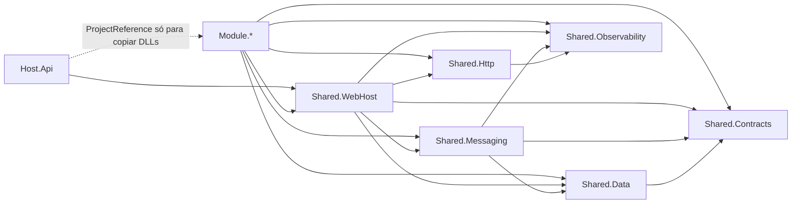
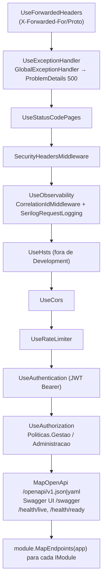

# Arquitetura

Este documento explica as decisões estruturais do monolito modular e como um request atravessa o sistema. As decisões estão registradas como ADRs em [`../adr/`](../adr/README.md); aqui está o "como funciona", com referência ao código real.

## 1. Três camadas de projetos: hosts, modules, shared

```
api/src/
  hosts/Host.Api                 # composição e execução; referencia Shared.WebHost e todos os Module.*
  modules/Module.<Nome>          # negócio; referencia apenas Shared.*
  shared/Shared.<Aspecto>        # transversal; nunca referencia Module.* nem Host.*
```

| Projeto | Responsabilidade | Depende de |
|---|---|---|
| `Shared.Contracts` | Contratos entre módulos: `I<X>ModuleApi`, eventos de integração (`IntegrationEvent`), `PagedResult`, `ICurrentUser`, `PerfisPadrao`/`Politicas` | nada (só abstrações do .NET) |
| `Shared.Data` | `EntidadeBase`, `ModuleDbContext`, `AuditoriaSaveChangesInterceptor`, `QueryTagInterceptor`, `OutboxMessage`/`OutboxStore`, `DatabaseMigrationHostedService`, `ExecuteInTransactionAsync`, `ToPagedResultAsync` | `Shared.Contracts` |
| `Shared.Observability` | `AddObservability`/`UseObservability` (Serilog + OpenTelemetry), `ModuleTelemetry`, `CorrelationIdMiddleware` | ASP.NET Core |
| `Shared.Http` | `Result`/`Error` → ProblemDetails, `IUseCase`, `IEndpoint`, `MapModuleGroup`, `ValidationFilter`, `TelemetryUseCaseDecorator` | `Shared.Observability` |
| `Shared.Messaging` | `IIntegrationEventPublisher` (in-process), `OutboxProcessor`, `OutboxOptions`, `AddIntegrationEventHandler` | `Contracts`, `Data`, `Observability` |
| `Shared.WebHost` | `IModule`, `ModuleDiscovery`, `AddModularWebHost`/`UseModularWebHost` (pipeline, JWT, políticas, rate limit, CORS, OpenAPI, health), `GlobalExceptionHandler`, `CurrentUser` | todos os `Shared.*` |
| `Module.<Nome>` | `Domain/`, `UseCases/`, `Shared/` (+ `Migrations/`) | todos os `Shared.*` |
| `Host.Api` | `Program.cs` (5 linhas), `appsettings*.json`, `Dockerfile` | `Shared.WebHost` + `Module.*` |

### Regras de dependência

1. **Um módulo nunca referencia outro módulo.** Não há `ProjectReference` entre `Module.*`; qualquer necessidade de dados de outro módulo passa por `Shared.Contracts`.
2. **`Shared.*` nunca conhece módulos.** Tudo o que é específico de um módulo (schema, telemetria, handlers) é registrado pelo próprio módulo em `ConfigureServices`.
3. **`Shared.Contracts` não tem dependências de infraestrutura.** É o único projeto que poderia virar um pacote NuGet compartilhado entre serviços no futuro.
4. **O host só compõe.** `Program.cs` chama `AddModularWebHost` e `UseModularWebHost`; a referência aos `Module.*` no `Host.Api.csproj` existe apenas para que os DLLs sejam copiados para a pasta de saída e descobertos.



## 2. `IModule` e descoberta

Cada módulo expõe uma classe pública que implementa `Shared.WebHost.Modules.IModule`:

```csharp
public interface IModule
{
    string Name { get; }         // = schema no banco e tag no Swagger ("Locais")
    string RoutePrefix { get; }  // segmento após api/v1/ ("locais")
    string Description { get; }  // markdown exibido no Swagger
    void ConfigureServices(IHostApplicationBuilder builder);
    void MapEndpoints(IEndpointRouteBuilder endpoints);
}
```

`ModuleDiscovery.Discover()` enumera `Module.*.dll` em `AppContext.BaseDirectory`, carrega os assemblies, instancia cada `IModule` com construtor sem parâmetros e ordena por `Name`. A lista é registrada como `IReadOnlyList<IModule>` e usada duas vezes: em `AddModularWebHost` (chama `ConfigureServices` de cada módulo **depois** de registrar toda a infraestrutura compartilhada) e em `UseModularWebHost` (chama `MapEndpoints` no fim do pipeline).

O módulo de referência (`api/src/modules/Module.Locais/Shared/LocaisModule.cs`) faz exatamente quatro coisas em `ConfigureServices`:

```csharp
builder.AddModuleDbContext<LocaisDbContext>(LocaisDbContext.SchemaName);   // pool, interceptors, Outbox store, registro para migração
builder.Services.AddScoped<ILocaisModuleApi, LocaisModuleApi>();           // contrato síncrono público
builder.Services.AddUseCasesFromAssembly(typeof(LocaisModule).Assembly, LocaisTelemetry.Instance); // IUseCase<,> + decorator
builder.Services.AddModuleValidators(typeof(LocaisModule).Assembly);       // FluentValidation
```

e em `MapEndpoints`: `endpoints.MapModuleGroup(RoutePrefix, Name).MapEndpointsFromAssembly(typeof(LocaisModule).Assembly)`.

`MapModuleGroup` cria `api/v1/{rota}` com uma única tag, `RequireAuthorization()` por padrão (endpoints anônimos precisam de `AllowAnonymous()` explícito) e documenta 401/403/500. `MapEndpointsFromAssembly` invoca o `Map` estático de cada `IEndpoint` do assembly, portanto um caso de uso novo não exige registro manual.

## 3. Pipeline do host

`Shared.WebHost.ModularWebHostExtensions` concentra a composição. Ordem real dos middlewares em `UseModularWebHost`:



Registro de serviços em `AddModularWebHost`, na ordem: descoberta de módulos → `AddObservability` → `AddSharedData` (interceptors, `ModuleDbContextRegistry`, `DatabaseMigrationHostedService`) → `AddSharedMessaging` (`OutboxOptions`, publicador, `OutboxProcessor`) → `ICurrentUser`, ProblemDetails com `traceId`, `GlobalExceptionHandler`, JSON (enums como string, nulos omitidos) → OpenAPI com transformers → segurança, rate limiting, CORS, health checks, forwarded headers → `module.ConfigureServices(builder)` para cada módulo.

A ordem importa para os hosted services: o migrador é registrado antes do `OutboxProcessor`, e ambos antes de qualquer hosted service de módulo (ex.: seed do Identidade). Como o .NET inicia hosted services em sequência, as migrações terminam antes do Outbox começar a ler tabelas e antes do seed rodar.

## 4. Ciclo de um request

Exemplo real: `POST /api/v1/locais/{id}/salas` (`AdicionarSalaEndpoint` → `AdicionarSalaUseCase`).

```mermaid
sequenceDiagram
    autonumber
    participant C as Cliente
    participant MW as Pipeline<br/>(correlação, JWT, rate limit)
    participant EP as AdicionarSalaEndpoint
    participant VF as ValidationFilter<AdicionarSalaRequest>
    participant DEC as TelemetryUseCaseDecorator
    participant UC as AdicionarSalaUseCase
    participant AG as Local (agregado)
    participant DB as LocaisDbContext
    participant INT as AuditoriaSaveChangesInterceptor
    participant PG as PostgreSQL (schema Locais)

    C->>MW: POST + Bearer JWT (+ X-Correlation-Id opcional)
    MW->>MW: Activity (trace) criada, CorrelationId no LogContext, política Gestao verificada
    MW->>EP: rota casada
    EP->>VF: request with { LocalId = id }
    alt inválido
        VF-->>C: 400 ValidationProblemDetails (codigo=Validacao, errors{})
    end
    VF->>DEC: IUseCase<AdicionarSalaRequest, AdicionarSalaResponse>
    DEC->>DEC: span "Locais.AdicionarSala" iniciado
    DEC->>UC: HandleAsync
    UC->>DB: Locais.TagWith("Locais.AdicionarSala.CarregarLocal").Include(Salas).FirstOrDefaultAsync
    DB->>PG: SELECT com comentário -- Locais.AdicionarSala.CarregarLocal (filtro SoftDelete aplicado)
    PG-->>UC: Local + Salas
    UC->>AG: local.AdicionarSala(nome, capacidade, tipo, recursos)
    alt nome duplicado
        AG-->>UC: Error Locais.SalaNomeDuplicado
        UC-->>DEC: Result falho
        DEC-->>EP: (métrica usecase.failures, tag error.code)
        EP-->>C: 409 ProblemDetails { codigo, traceId }
    end
    UC->>DB: ExecuteInTransactionAsync → SaveChangesAsync
    DB->>INT: SavingChangesAsync
    INT->>INT: CriadoEm/CriadoPor na Sala; AlteradoEm/Por no Local; EntidadeAlterada por entidade; eventos do agregado
    INT->>DB: OutboxMessages.AddRange(...)
    DB->>PG: BEGIN; INSERT Salas; UPDATE Locais; INSERT OutboxMessages; COMMIT
    UC-->>DEC: Result.Success(response)
    DEC-->>EP: (métricas usecase.executions/usecase.duration; span fechado)
    EP-->>C: 201 Created + Location + X-Correlation-Id
```

Pontos a observar:

- **Ids de rota** entram no request por `request with { LocalId = id }`; a propriedade é `[JsonIgnore]` para não aparecer no corpo nem no schema OpenAPI.
- **Erros de negócio nunca são exceções.** `Result<T>` falho vira ProblemDetails por `ToHttpResult`/`ToCreatedResult`/`ToNoContentResult`; o mapeamento `ErrorType` → status está em `ResultHttpExtensions.ToProblem` (Validation 400, NotFound 404, Conflict 409, BusinessRule 422, Unauthorized 401, Forbidden 403, Failure 500).
- **Exceções inesperadas** caem no `GlobalExceptionHandler`: log com `TraceId`, 500 (ou 499 se o cliente cancelou), `Detail` genérico fora de Development.
- **A transação** de `ExecuteInTransactionAsync` usa a `IExecutionStrategy` do Npgsql (`EnableRetryOnFailure(3)`): em falha transitória o bloco inteiro roda de novo, por isso o bloco deve conter apenas operações idempotentes em memória + `SaveChangesAsync`.

### Depois do commit: Outbox → processador → handlers

```mermaid
sequenceDiagram
    autonumber
    participant OP as OutboxProcessor<br/>(BackgroundService)
    participant ST as OutboxStore<LocaisDbContext>
    participant PG as PostgreSQL
    participant REG as IntegrationEventTypeRegistry
    participant PUB as InProcessIntegrationEventPublisher
    participant H as IIntegrationEventHandler<EntidadeAlterada><br/>(Module.Auditoria)

    loop a cada Outbox:PollingIntervalMs (2 s) ou imediatamente se houve trabalho
        OP->>ST: ClaimBatchAsync(BatchSize=50, LockSeconds=60)
        ST->>PG: SELECT ids pendentes (ProcessedOn IS NULL e lock vencido) ORDER BY OccurredOn
        ST->>PG: UPDATE ... SET LockedUntil = agora+60s WHERE ainda livre (claim otimista)
        ST->>PG: SELECT mensagens cujo LockedUntil == o meu
        PG-->>OP: lote
        OP->>OP: Activity "outbox process EntidadeAlterada" com parent = TraceParent gravado
        OP->>REG: Resolve(Type) → tipo CLR em Shared.Contracts
        OP->>PUB: PublishAsync(evento desserializado)
        PUB->>H: HandleAsync (span "consume EntidadeAlterada", ActivityKind.Consumer)
        alt sucesso
            OP->>ST: MarkProcessedAsync → ProcessedOn = agora, lock e erro limpos
            OP->>OP: outbox.messages.processed++, outbox.delivery.latency
        else falha em algum handler
            PUB-->>OP: AggregateException
            OP->>ST: MarkFailedAsync(erro, atraso = min(300s, 2^tentativa); 365 dias após MaxAttempts)
            OP->>OP: outbox.messages.failed++
        end
    end
```

O processamento acontece **no mesmo trace** da requisição original porque o interceptor grava `Activity.Current.Id` (traceparent) em `OutboxMessage.TraceParent`. No Aspire Dashboard, o span `outbox process ...` aparece pendurado no request que o originou.

## 5. Contratos entre módulos

### Síncronos: `I<X>ModuleApi`

Interface em `Shared.Contracts.<Modulo>`, implementada dentro do módulo dono (ex.: `LocaisModuleApi`, `internal`, registrada como scoped) e injetada nos casos de uso consumidores. Regras:

- Retornam **resumos** (`LocalResumo`, `SalaResumo`, `PessoaResumo`, `EventoResumo`) com projeção mínima, `AsNoTracking()` e `TagWith("Modulo.ModuleApi.Metodo")`.
- Nunca expõem entidades nem `DbContext`; nunca escrevem.
- Chamada em processo, na mesma requisição e trace; a transação do consumidor **não** engloba o banco do produtor (cada módulo tem seu `DbContext`), o que é aceitável porque as Module APIs são somente leitura.

### Assíncronos: eventos de integração via Outbox

Records `sealed` herdando `IntegrationEvent` (`Id` Guid v7 + `OcorridoEm`), declarados em `Shared.Contracts`. O agregado chama `RegistrarEvento(...)`; o `AuditoriaSaveChangesInterceptor` serializa cada evento para `OutboxMessages` do schema do módulo, na mesma transação. `IntegrationEventTypeRegistry` só resolve tipos do assembly `Shared.Contracts`, logo um evento declarado dentro de um módulo **não** seria entregue.

Consumo: o módulo interessado registra `services.AddIntegrationEventHandler<TEvento, THandler>()`. Handlers devem ser **idempotentes**: falha em um handler faz a mensagem inteira voltar para retry e todos os handlers rodarem de novo.

### Quem consome quem

| Consumidor → Produtor | Síncrono (`Shared.Contracts`) | Para quê |
|---|---|---|
| Eventos → Locais | `ILocaisModuleApi.ObterLocalResumoAsync` | validar `localId` em Presencial/Híbrido; `localNome` no detalhe; capacidade padrão para inscrições |
| Eventos → Pessoas | `IPessoasModuleApi.ObterPessoaResumoAsync`, `ObterPessoasResumoAsync` | validar pessoa na inscrição; nomes na listagem de inscrições |
| Eventos → Palestras | `IPalestrasModuleApi.ContarPalestrasDoEventoAsync` | publicar exige ao menos uma palestra |
| Palestras → Eventos | `IEventosModuleApi.ObterEventoResumoAsync`, `InscricaoConfirmadaExisteAsync` | período e situação do evento; presença só para inscrito |
| Palestras → Locais | `ILocaisModuleApi.ObterSalaResumoAsync`, `ObterLocalResumoAsync` | sala existe, está ativa e pertence ao local do evento |
| Palestras → Pessoas | `IPessoasModuleApi.*` | palestrantes existem; nomes em detalhes e certificados |

| Evento de integração | Produtor | Consumidores conhecidos |
|---|---|---|
| `EntidadeAlterada` | infraestrutura (`AuditoriaSaveChangesInterceptor`), em nome de todo módulo com `AuditChangesEnabled` | Auditoria (`EntidadeAlteradaHandler`) |
| `LocalCriado`, `LocalExcluido` | Locais | nenhum hoje (disponíveis) |
| `PessoaCriada`, `PessoaExcluida` | Pessoas | nenhum hoje |
| `EventoPublicado`, `EventoCancelado`, `InscricaoRealizada`, `InscricaoCancelada` | Eventos | nenhum hoje (candidatos: notificações, relatórios) |
| `PalestraCriada`, `PresencaRegistrada`, `CertificadoEmitido` | Palestras | nenhum hoje |
| `UsuarioRegistrado`, `UsuarioAutenticado` | Identidade | nenhum hoje |

Sem handler registrado, o `InProcessIntegrationEventPublisher` apenas loga em Debug e a mensagem é marcada como processada.

Há ciclos de **contrato** (Eventos ↔ Palestras) mas não de **projeto**: ambos dependem só de `Shared.Contracts`. Se um dia isso incomodar, a regra "publicar exige palestra" pode virar uma projeção mantida por `PalestraCriada` dentro de Eventos.

## 6. Extrair um módulo para um serviço, sem reescrever

O desenho já paga o custo da separação; o que falta na extração é infraestrutura, não código de negócio.

| Já resolvido no monolito | O que muda na extração |
|---|---|
| Schema próprio, `__EFMigrationsHistory` próprio, sem FK cruzada | `pg_dump --schema=Palestras` para um banco novo; ou manter o mesmo banco no início |
| `Module.Palestras` só referencia `Shared.*` | criar `Host.Palestras` (cópia do `Host.Api` referenciando só esse módulo); `ModuleDiscovery` continua funcionando |
| Contratos síncronos via `IPalestrasModuleApi` | o consumidor (Eventos) troca a implementação registrada por um cliente HTTP/gRPC que implementa a **mesma interface**; os casos de uso não mudam |
| Eventos de integração já passam por Outbox com `Type` = nome completo + payload JSON | trocar `InProcessIntegrationEventPublisher` por um publicador para broker (RabbitMQ, Service Bus) implementando `IIntegrationEventPublisher`; o `OutboxProcessor` não muda |
| Telemetria por módulo (`GestaoEventos.Palestras`) e `traceparent` no Outbox | traces distribuídos continuam ligados; só o `service.name` muda |
| JWT validado em `Shared.WebHost` com a mesma chave/issuer | o novo host valida o mesmo token; nenhuma mudança nos endpoints |

Passos, na prática: (1) criar o host; (2) apontar o novo host para o schema (mesmo banco ou banco novo); (3) publicar `Shared.Contracts` como pacote; (4) trocar a implementação de `IPalestrasModuleApi` no `Host.Api` por um adaptador remoto; (5) trocar o publicador por broker nos dois lados; (6) redirecionar `api/v1/palestras` no gateway/proxy. Nada em `Domain/` ou `UseCases/` é tocado.

Do mesmo modo, um `Host.Worker` que só processe o Outbox nasce com `AddSharedData` + `AddSharedMessaging` + os módulos que possuem handlers, e `Outbox:Enabled=false` no `Host.Api`.

## 7. Testes

Três projetos em `api/tests/`: `Tests.Unit` (xUnit + Shouldly + NSubstitute; referencia `Shared.Http` e módulos para testar agregados, validators e casos de uso com contratos mockados), `Tests.Integration` (`WebApplicationFactory<Program>` + Testcontainers PostgreSQL, subindo o host real com todos os módulos) e `Tests.Functional` (Reqnroll sobre a mesma factory, cenários em linguagem de negócio). `Program` é `public partial class` justamente para a factory.

## 8. Front

Estrutura (convenção do `CLAUDE.md`; implementação em andamento): páginas em `front/src/modules/<modulo>/<use-case>/`, montadas somente com componentes genéricos de `front/src/shared/components/generic` sobre shadcn (`front/src/shared/components/ui`); tipos alinhados a `docs/contracts/v1/openapi.yaml`. Em dev, o Vite faz proxy de `/api` para `http://localhost:5761`; no compose, o nginx do container `front` faz proxy para o serviço `api`.
