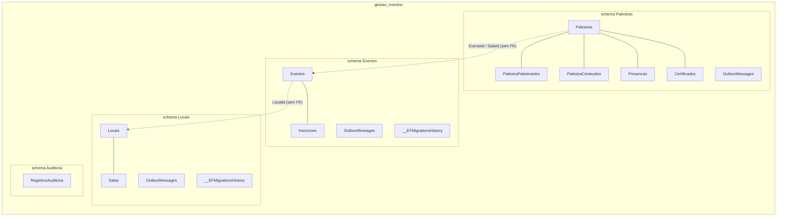

# Dados

Como o projeto usa o PostgreSQL e o EF Core 10. Todo o comportamento descrito aqui está em `api/src/shared/Shared.Data` e é herdado por qualquer `<Modulo>DbContext : ModuleDbContext`.

## 1. Um banco, um schema por módulo

Um único banco (`gestao_eventos`) e uma única connection string (`ConnectionStrings:GestaoEventos`). Cada módulo tem um `DbContext` próprio com `HasDefaultSchema(Schema)`, onde `Schema` = nome do módulo (`Locais`, `Pessoas`, `Eventos`, `Palestras`, `Identidade`, `Auditoria`). Dentro de cada schema existem as tabelas do módulo, a tabela `OutboxMessages` e a `__EFMigrationsHistory` daquele módulo.



Regras:

- **FK só dentro do schema.** `Salas.LocalId → Locais.Id` existe; `Eventos.LocalId → Locais.Locais` **não** existe. Referências entre módulos são `Guid` simples validados pelos contratos síncronos. Isso permite mover um schema para outro banco sem quebrar constraints.
- **Um `DbContext` não enxerga tabelas de outro schema.** Consultas cruzadas são proibidas; se um relatório precisar juntar módulos, ele é um caso de uso que chama Module APIs ou uma projeção alimentada por eventos.
- Um usuário de banco por módulo (com `GRANT` restrito ao próprio schema) é possível no futuro sem mudar código, trocando a connection string por contexto.

## 2. Convenções de nomes e tipos

- Tabelas e colunas em **PascalCase**, sem plural forçado pelo EF: `ConfigurarEntidadeBase("Locais")` define `ToTable` explicitamente. Como PascalCase exige aspas no PostgreSQL, consultas manuais usam `"Locais"."Salas"`.
- `ModuleDbContext.ConfigureConventions`: `string` → `varchar(200)` por padrão (sobrescrito por `HasMaxLength` nas configurações), `decimal` → `numeric(18,2)`, **enums como string** (`varchar(50)`), `DateTimeOffset` → `timestamptz`.
- Configurações em `Shared/Configuracoes/<Entidade>Configuration.cs` (`IEntityTypeConfiguration<T>`), aplicadas por `ApplyConfigurationsFromAssembly`.
- Índices únicos de negócio são **filtrados** por `"ExcluidoEm" IS NULL` para conviver com soft delete (ex.: `IX_Locais_LocalNome`, `IX_Salas_LocalId_SalaNome`). O índice é a última linha de defesa: o caso de uso verifica antes (`AnyAsync`) e devolve `409`; uma corrida entre dois requests termina em `DbUpdateException` (500), o que é aceitável para este domínio.

## 3. Chave primária: Guid v7

`EntidadeBase.Id = Guid.CreateVersion7()` gerado **na aplicação** (`ValueGeneratedNever()`), tipo `uuid`. Guid v7 é ordenável por tempo, o que mantém o índice B-tree da PK crescendo no fim (sem fragmentação típica do Guid v4) e permite o agregado conhecer seu Id antes do `INSERT` (necessário para registrar eventos de integração com o Id e para o `Location` do 201). `OutboxMessage.Id` e `IntegrationEvent.Id` também são v7.

## 4. Campos de auditoria e `IEntidadeAuditavel`

Toda entidade principal herda `EntidadeBase` e ganha `CriadoEm`, `CriadoPor`, `AlteradoEm`, `AlteradoPor`, `ExcluidoEm`, `ExcluidoPor`, `EstaAtivo`. Eles são preenchidos pelo `AuditoriaSaveChangesInterceptor`, nunca pelo código do módulo:

| Estado no `ChangeTracker` | O que o interceptor faz |
|---|---|
| `Added` | `CriadoEm = agora (UTC, TimeProvider)`, `CriadoPor = ICurrentUser.Nome ?? Email ?? "sistema"` |
| `Modified` | `AlteradoEm/Por`; força `CriadoEm/CriadoPor` como não modificados |
| `Deleted` | vira `Modified` com `ExcluidoEm/Por` e `EstaAtivo = false` (soft delete) |

`CriadoPor`/`AlteradoPor`/`ExcluidoPor` têm `HasMaxLength(150)`; `ExcluidoEm` recebe índice automático em toda entidade auditável (`IX_<Tabela>_ExcluidoEm`), porque o filtro global consulta essa coluna sempre.

`EstaAtivo` é **negócio** (ex.: sala indisponível para alocação) e é diferente de excluído; use `Ativar()`/`Desativar()`.

## 5. Soft delete

Implementado em dois pontos:

1. **Escrita**: `db.Set<T>().Remove(x)` é convertido pelo interceptor em `UPDATE` com `ExcluidoEm`, `ExcluidoPor`, `EstaAtivo=false`. Não existe `DELETE` físico via EF em entidades auditáveis. Exemplo real: `ExcluirLocalUseCase` faz `db.Salas.RemoveRange(local.Salas); db.Locais.Remove(local);` e o banco recebe apenas updates.
2. **Leitura**: `ModuleDbContext.OnModelCreating` aplica a toda entidade `IEntidadeAuditavel` um **filtro global nomeado** `SoftDelete` (`ModuleDbContext.SoftDeleteFilterName`) com a expressão `e => e.ExcluidoEm == null`. O filtro vale também para navegações e projeções (`l.Salas.Count` conta só salas não excluídas).

Como ignorar o filtro quando for legítimo (relatórios administrativos, restauração):

```csharp
// EF Core 10: ignora apenas o filtro nomeado, preservando outros filtros que a entidade tenha
db.Locais.IgnoreQueryFilters([ModuleDbContext.SoftDeleteFilterName]).TagWith("Locais.Admin.ListarExcluidos")

// ignora todos os filtros da consulta
db.Locais.IgnoreQueryFilters().TagWith("Locais.Admin.ListarTudo")
```

Cuidados: índices únicos devem ser filtrados (item 2); comparações manuais dentro de coleções carregadas devem checar `ExcluidoEm is null` (o agregado `Local` faz isso em `AdicionarSala`/`RemoverSala`); `Include` respeita o filtro.

## 6. `TagWith` obrigatório (regra do DBA)

Toda consulta começa com `.TagWith("Modulo.CasoDeUso[.Etapa]")`. O EF emite a tag como comentário na primeira linha do SQL, visível em `pg_stat_activity`, `pg_stat_statements` (dependendo de `compute_query_id`), logs do PostgreSQL e no span do OpenTelemetry.

SQL gerado por `ListarLocaisUseCase` (tag `Locais.ListarLocais`), simplificado:

```sql
-- Locais.ListarLocais

SELECT l."Id", l."LocalNome", l."EnderecoCidade", l."EnderecoUf",
       (SELECT count(*)::int FROM "Locais"."Salas" AS s WHERE l."Id" = s."LocalId" AND s."ExcluidoEm" IS NULL) AS "SalasQuantidade",
       (SELECT COALESCE(sum(s0."SalaCapacidade"), 0)::int FROM "Locais"."Salas" AS s0 WHERE l."Id" = s0."LocalId" AND s0."ExcluidoEm" IS NULL) AS "LocalCapacidadeTotal",
       l."EstaAtivo"
FROM "Locais"."Locais" AS l
WHERE l."ExcluidoEm" IS NULL
ORDER BY l."LocalNome"
LIMIT @__p_1 OFFSET @__p_0
```

Consulta do DBA para ver o que está rodando agora, por caso de uso:

```sql
SELECT pid, now() - query_start AS duracao, state, wait_event_type,
       split_part(query, E'\n', 1) AS tag,          -- "-- Locais.ListarLocais"
       left(query, 200) AS inicio_query
FROM pg_stat_activity
WHERE datname = 'gestao_eventos' AND query LIKE '-- %'
ORDER BY duracao DESC;
```

Fiscalização: `QueryTagInterceptor` (`DbCommandInterceptor`) inspeciona todo `SELECT`; se o comando não começa com `-- ` (e não é da `__EFMigrationsHistory`), loga `Warning` com o início do SQL e incrementa `db.queries.untagged` (tag `db.context`). Ele não bloqueia a consulta; a regra é mensurável e revisável em code review. `ExecuteUpdateAsync`/`ExecuteDeleteAsync` e comandos de escrita não são inspecionados; ainda assim, o `OutboxStore` marca todos os seus comandos.

## 7. Leituras e escritas

**Leituras**: `AsNoTracking()` + `Select` projetando direto para o `Response` (só as colunas necessárias). Exemplo: `ObterLocalUseCase` monta `ObterLocalResponse` com subconsulta de salas em uma única query. Não carregue agregados inteiros para ler.

**Escritas**: carregue o agregado com tracking (o padrão do contexto é `TrackAll`), aplique a regra no domínio, então:

```csharp
return await db.ExecuteInTransactionAsync(async ct =>
{
    db.Locais.Add(local);            // ou apenas mutações já feitas no agregado
    await db.SaveChangesAsync(ct);   // interceptor: auditoria + soft delete + Outbox
    return Result.Success(new CriarLocalResponse(local.Id, local.LocalNome, local.Salas.Count));
}, cancellationToken);
```

`ExecuteInTransactionAsync` (`Shared.Data.Extensions.DbContextTransactionExtensions`) cria a `IExecutionStrategy` do provider, abre uma transação explícita, executa o bloco e faz `Commit`. Com `EnableRetryOnFailure(maxRetryCount: 3)`, falhas transitórias (queda de conexão, failover) re-executam o **bloco inteiro**; por isso o bloco deve conter apenas trabalho repetível (o estado já está no `ChangeTracker`). `CommandTimeout` = 30 s.

Por que uma transação explícita se `SaveChangesAsync` já é atômico? Para deixar o contrato claro para quem precisar de mais de um `SaveChanges` ou de `ExecuteUpdateAsync` junto, e para garantir que o Outbox e o negócio nunca se separem quando o caso de uso crescer.

**Pool de contextos**: `AddDbContextPool<TContext>` reaproveita instâncias; consequência: nada de estado por requisição dentro do `DbContext`, e serviços usados por interceptors são singletons (`ICurrentUser` via `IHttpContextAccessor`, `TimeProvider`).

## 8. Paginação

`PagedRequest(Pagina = 1, TamanhoPagina = 20)` com `TamanhoMaximo = 100`; o validator do caso de uso rejeita fora da faixa e `PagedRequest` normaliza por segurança. `ToPagedResultAsync` (`Shared.Data.Extensions.PagingExtensions`) executa `LongCountAsync` + `Skip/Take` **sobre a consulta já projetada e ordenada** e devolve `PagedResult<T> { Itens, Pagina, TamanhoPagina, Total, TotalPaginas }`. Sempre ordene antes de paginar (ordem indefinida no PostgreSQL sem `ORDER BY`). Para listas curtas e limitadas por natureza (salas de um local, presenças de uma palestra) a API devolve `IReadOnlyList<T>` sem paginação.

## 9. Migrações

- **Por módulo, no projeto do módulo** (`Migrations/`), com `MigrationsAssembly` = assembly do módulo e `MigrationsHistoryTable("__EFMigrationsHistory", schema)`. Cada schema tem seu histórico; módulos evoluem de forma independente.
- **Design time**: cada módulo declara `sealed class <Modulo>DbContextFactory : DesignTimeDbContextFactoryBase<<Modulo>DbContext>` (duas linhas). A fábrica usa `ConnectionStrings__GestaoEventos` do ambiente ou a connection string do compose. Comando:
  `dotnet ef migrations add <Nome> --project src/modules/Module.<X> --startup-project src/modules/Module.<X> --context <X>DbContext --output-dir Migrations`
- **Na subida**: `DatabaseMigrationHostedService` roda quando `Database:MigrateOnStartup=true` (padrão nos `appsettings.json` e no compose). Ele abre uma conexão dedicada, executa `SELECT pg_advisory_lock(7202410)`, percorre `ModuleDbContextRegistry.Contexts` (preenchido por `AddModuleDbContext`), aplica as pendentes de cada contexto com `MigrateAsync` e libera o lock no `finally`. Várias réplicas subindo ao mesmo tempo esperam umas pelas outras em vez de colidir.
- **Em produção crítica**: prefira `MigrateOnStartup=false` e aplicar por pipeline com script idempotente (`dotnet ef migrations script --idempotent`) revisado por par. Passo a passo em [runbooks/migracoes-banco.md](../runbooks/migracoes-banco.md).
- A migração inicial de Locais (`20260919021757_Inicial`) mostra o resultado esperado: `EnsureSchema`, tabelas PascalCase, `OutboxMessages` com índice `IX_OutboxMessages_Pendentes (ProcessedOn, LockedUntil, OccurredOn)`, índices filtrados e `IX_<Tabela>_ExcluidoEm`.

## 10. Outbox

### Tabela `OutboxMessages` (em cada schema)

| Coluna | Tipo | Significado |
|---|---|---|
| `Id` | uuid (v7) | PK |
| `Type` | varchar(500) | nome CLR completo do evento (`Shared.Contracts.Locais.LocalCriado`) |
| `Payload` | jsonb | evento serializado (camelCase, enums como string) |
| `OccurredOn` | timestamptz | quando foi gravado (mesma transação do negócio) |
| `ProcessedOn` | timestamptz? | quando foi entregue; `NULL` = pendente |
| `Attempts` | int | tentativas com falha |
| `Error` | varchar(2000) | último erro (truncado) |
| `LockedUntil` | timestamptz? | claim do processador; vencido = livre para outro |
| `TraceParent` | varchar(100) | `Activity.Current.Id` do request original |

### Gravação

`AuditoriaSaveChangesInterceptor` transforma em `OutboxMessage`: (a) cada `IIntegrationEvent` acumulado por entidades `IEmissorDeEventos` (depois limpa a lista), e (b) um `EntidadeAlterada` por entidade `Added`/`Modified` quando `db.AuditChangesEnabled` (o contexto de Auditoria desliga isso). Tudo entra no mesmo `SaveChanges`, portanto na mesma transação: ou o negócio e as mensagens são gravados, ou nada é.

### Claim otimista e paralelismo

`OutboxStore<TContext>.ClaimBatchAsync` em três comandos: seleciona ids pendentes com lock vencido (ordenados por `OccurredOn`, `Take(batchSize)`), faz `ExecuteUpdateAsync` de `LockedUntil = agora + LockSeconds` **apenas onde ainda estão livres**, e lê de volta as linhas cujo `LockedUntil` é exatamente o seu. Duas instâncias da API (ou um `Host.Worker`) podem processar o mesmo schema sem entregar duas vezes; se uma instância morrer com o lote em mãos, o lock expira em `LockSeconds` e outra assume.

### Retry e backoff

Em falha: `Attempts + 1`, `Error` preenchido e `LockedUntil = agora + min(300 s, 2^tentativa s)`. Ao atingir `Outbox:MaxAttempts` (10), o atraso passa a 365 dias: a mensagem fica "estacionada" para intervenção manual sem sair da tabela. Sucesso limpa `Error` e `LockedUntil` e grava `ProcessedOn`. Entrega é **at-least-once**; handlers devem ser idempotentes (o módulo Auditoria usa o `Id` do evento como PK do registro).

### Limpeza

Não há purga automática. Recomenda-se job periódico `DELETE FROM "<Schema>"."OutboxMessages" WHERE "ProcessedOn" < now() - interval '30 days'` (ou particionamento por mês), ver [runbooks/operacao-outbox.md](../runbooks/operacao-outbox.md).

## 11. Módulo Auditoria (destino)

`RegistroAuditoria` **não** herda `EntidadeBase` (é imutável): `Id` = `Id` do evento `EntidadeAlterada` (idempotência), `Modulo`, `EntidadeNome`, `EntidadeId`, `Operacao` (`Inclusao`/`Alteracao`/`Exclusao`), `DadosAnteriores`/`DadosNovos` (jsonb), `UsuarioId`, `UsuarioNome`, `TraceId`, `OcorridoEm`, `RegistradoEm`. Índices: `(Modulo, EntidadeNome, EntidadeId)`, `OcorridoEm`, `UsuarioId`. `AuditoriaDbContext.AuditChangesEnabled => false` evita auditar a própria auditoria.

Em `Inclusao`, `DadosNovos` contém todas as propriedades; em `Alteracao`/`Exclusao`, apenas as modificadas (antes e depois). Como o payload inclui colunas de Pessoas e Identidade, o acesso é restrito e a retenção precisa de política (ver [seguranca.md](seguranca.md), seção LGPD).

## 12. Checklist para o DBA

- Extensões: nenhuma obrigatória; `pg_stat_statements` recomendado.
- Índices que importam em produção: PKs (v7), `IX_*_ExcluidoEm`, únicos filtrados, `IX_OutboxMessages_Pendentes`, índices de Auditoria.
- `Maximum Pool Size=100` na connection string (por instância da API); dimensione `max_connections` do PostgreSQL de acordo com o número de réplicas ou use PgBouncer em modo transação.
- `TZ=America/Sao_Paulo` no container é cosmético para logs; todas as colunas são `timestamptz` e a aplicação grava UTC.
