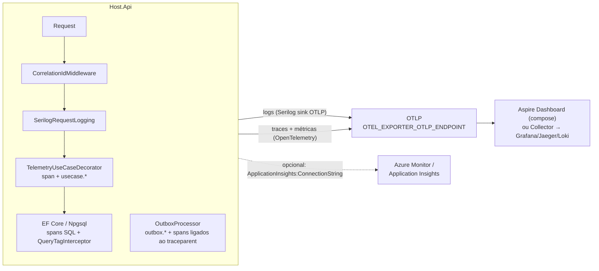

# Observabilidade

Observabilidade é um dos três pilares do projeto (com segurança e performance). Tudo está em `api/src/shared/Shared.Observability` e é ligado pelo host com `AddObservability("GestaoEventos.Api")` e `UseObservability()`; os módulos não escrevem código de telemetria além de nomear spans e consultas.

## 1. Visão geral

## 2. Logs: Serilog

Configurado em `ObservabilityExtensions.AddObservability` com `builder.Services.AddSerilog(...)`:

| Aspecto | Como está |
|---|---|
| Configuração | `ReadFrom.Configuration` (seção `Serilog` do `appsettings`) + `ReadFrom.Services` |
| Enriquecimento | `FromLogContext`, `WithMachineName`, `WithEnvironmentName`, `WithThreadId`, `WithExceptionDetails` (Serilog.Exceptions), propriedades fixas `Application` e `Version` |
| TraceId/SpanId | adicionados automaticamente pelo Serilog a partir de `Activity.Current`; o template de Development imprime `{TraceId}` |
| CorrelationId | `CorrelationIdMiddleware` faz `LogContext.PushProperty("CorrelationId", ...)` para toda a requisição |
| Sink console | Development: template legível `[HH:mm:ss LVL] {TraceId} {Message}`; Production: `CompactJsonFormatter` (uma linha JSON por evento, pronta para coleta por stdout) |
| Sink OTLP | `WriteTo.OpenTelemetry` habilitado **somente** quando `OTEL_EXPORTER_OTLP_ENDPOINT` está definido; leva `service.name` e `service.version` como resource |
| Níveis | `Information` por padrão; `Microsoft.AspNetCore`, `Microsoft.EntityFrameworkCore.Database.Command` e `System.Net.Http.HttpClient` em `Warning` em produção; em Development os comandos EF ficam em `Information` (útil para ver o `TagWith` no SQL) |

### Log de requisição

`UseSerilogRequestLogging` com o template `HTTP {RequestMethod} {RequestPath} => {StatusCode} em {Elapsed:0.0} ms`. Nível: `Error` se houve exceção ou status ≥ 500; `Verbose` para `/health`; `Information` para o resto. Propriedades adicionadas: `ClientIp`, `UserAgent`, `UsuarioId` (claim `sub`/`NameIdentifier`), `TraceId`, `CorrelationId`.

### Correlação

`X-Correlation-Id`: aceito do cliente; se ausente, usa o `TraceId` corrente (ou um Guid v7). Sempre devolvido no response (e exposto no CORS). Vira a tag `correlation.id` no span do request e a propriedade `CorrelationId` nos logs. Uso típico: o front gera um id por ação do usuário e o envia em todas as chamadas daquela ação; o suporte busca por ele.

### O que não logar

Segredos, tokens, senhas e dados pessoais desnecessários (regra 8 do `CLAUDE.md`). O log de erro de negócio do decorator registra apenas `UseCase`, `ErrorCode` e `ErrorMessage`; o request não é serializado.

## 3. Traces e métricas: OpenTelemetry

### Resource

`service.name` = nome passado pelo host (`GestaoEventos.Api`), `service.version` = versão do assembly, `service.instance.id` = nome da máquina/container, `deployment.environment` = `ASPNETCORE_ENVIRONMENT`.

### Fontes de trace

| Fonte | Origem | O que gera |
|---|---|---|
| `GestaoEventos.*` (wildcard) | `ModuleTelemetry` de cada módulo + `GestaoEventos.Messaging` | spans `Locais.CriarLocal`, `Eventos.InscreverParticipante`, `outbox process X`, `consume X` |
| ASP.NET Core | `AddAspNetCoreInstrumentation` | span do request; `RecordException=true`; ignora `/health` e `/swagger`; enriquece com `correlation.id` |
| HttpClient | `AddHttpClientInstrumentation` | chamadas de saída (hoje nenhuma no domínio; útil ao extrair módulos) |
| EF Core | `AddEntityFrameworkCoreInstrumentation` | spans por comando com o SQL (inclui o comentário do `TagWith`) |
| Npgsql | `AddNpgsql` | spans de conexão/comando do driver |

### `ModuleTelemetry` por módulo

Cada módulo declara `internal static class <Modulo>Telemetry { public static readonly ModuleTelemetry Instance = new("<Modulo>"); }`. Isso cria um `ActivitySource` e um `Meter` chamados `GestaoEventos.<Modulo>`. O `TelemetryUseCaseDecorator` (aplicado automaticamente a todo `IUseCase<,>` por `AddUseCasesFromAssembly`) usa essa instância para:

- abrir um span `"<Modulo>.<CasoDeUso>"` (nome derivado do tipo do request sem o sufixo `Request`);
- em falha de negócio, marcar `error.code` e `error.type` no span e logar em `Information`;
- em exceção, marcar `ActivityStatusCode.Error` e relançar;
- registrar as métricas abaixo.

### Métricas

| Meter | Instrumento | Tipo | Tags | Significado |
|---|---|---|---|---|
| `GestaoEventos.<Modulo>` | `usecase.executions` | counter | `usecase`, `module` | execuções de casos de uso |
| `GestaoEventos.<Modulo>` | `usecase.failures` | counter | `usecase`, `module`, `error.code` | falhas de negócio (`Result` falho) ou exceção (`error.code=Excecao`) |
| `GestaoEventos.<Modulo>` | `usecase.duration` | histogram (ms) | `usecase`, `module` | duração do caso de uso |
| `GestaoEventos.Messaging` | `outbox.messages.processed` | counter | `module`, `event.type` | mensagens entregues |
| `GestaoEventos.Messaging` | `outbox.messages.failed` | counter | `module`, `event.type` | tentativas com falha |
| `GestaoEventos.Messaging` | `outbox.delivery.latency` | histogram (ms) | `module`, `event.type` | tempo entre `OccurredOn` e a entrega |
| `GestaoEventos.Data` | `db.queries.untagged` | counter | `db.context` | consultas `SELECT` executadas sem `TagWith` (o `QueryTagInterceptor` também loga `Warning`) |
| runtime / process | `AddRuntimeInstrumentation`, `AddProcessInstrumentation` | — | — | GC, thread pool, CPU, memória |
| ASP.NET Core / HttpClient / Npgsql | instrumentações oficiais | — | — | `http.server.request.duration`, pool de conexões etc. |

Meters capturados: `GestaoEventos.*` por wildcard; portanto um módulo novo é coletado sem mexer na configuração.

## 4. Exportação

### OTLP (padrão; VPS e compose)

Se `OTEL_EXPORTER_OTLP_ENDPOINT` estiver definido, `otel.UseOtlpExporter()` exporta traces e métricas e o Serilog exporta logs para o mesmo endpoint. O protocolo segue `OTEL_EXPORTER_OTLP_PROTOCOL` (`grpc` no compose). No `docker-compose.yml`, o serviço `otel` é o **Aspire Dashboard** (`mcr.microsoft.com/dotnet/aspire-dashboard:9.4`): UI em http://localhost:18888, OTLP gRPC interno em `otel:18889` (publicado no host como `4317`). Ele é volátil (sem persistência) e serve para desenvolvimento e demonstração; em produção aponte para um OpenTelemetry Collector, Grafana Alloy, Tempo/Loki/Mimir, Jaeger ou similar.

Rodando a API fora do container com o dashboard do compose: `OTEL_EXPORTER_OTLP_ENDPOINT=http://localhost:4317`.

### Application Insights (Azure)

Se `ApplicationInsights:ConnectionString` (env `ApplicationInsights__ConnectionString`) estiver preenchida, `otel.UseAzureMonitor(...)` (pacote `Azure.Monitor.OpenTelemetry.AspNetCore`) envia traces, métricas e logs do ILogger para o Azure Monitor. Pode coexistir com OTLP. Nenhuma mudança de código: só configuração, o que permite a mesma imagem rodar em Azure e VPS.

## 5. Health checks

| Endpoint | Verificação | Uso |
|---|---|---|
| `GET /health/live` | nenhuma (`Predicate = _ => false`): responde 200 se o processo atende HTTP | `HEALTHCHECK` do Dockerfile, liveness probe |
| `GET /health/ready` | checks com tag `ready`: hoje `postgres` (`AddNpgSql`) | readiness probe, `depends_on` de orquestradores, balanceador |

Ambos anônimos e excluídos dos traces; o log de requisição deles fica em `Verbose`.

## 6. O que olhar em incidentes

| Sintoma | Onde olhar | Como ligar as pontas |
|---|---|---|
| Cliente recebe 500 com `traceId` | Aspire/Tempo: buscar o trace pelo id; logs: filtrar `TraceId` | o `GlobalExceptionHandler` loga `Exceção não tratada. TraceId=...` com a stack; o ProblemDetails só traz o id |
| Erros de negócio em alta | métrica `usecase.failures` por `error.code` e `module` | códigos são estáveis (`Eventos.CapacidadeEsgotada`); dashboards por código |
| Latência em um caso de uso | `usecase.duration` (p95 por `usecase`), spans EF dentro do span do caso de uso | o SQL no span traz o `TagWith`; compare com `pg_stat_statements` |
| Auditoria "atrasada" ou evento não consumido | `outbox.delivery.latency`, `outbox.messages.failed`, log `Falha ao processar mensagem {MessageId}`; tabela `<Schema>.OutboxMessages` | ver [runbooks/operacao-outbox.md](../runbooks/operacao-outbox.md) |
| Consulta lenta reportada pelo DBA | `pg_stat_activity.query` mostra `-- Modulo.CasoDeUso` | vai direto ao arquivo do caso de uso |
| Warning `Consulta sem TagWith detectada` | `db.queries.untagged` por `db.context` | regra do projeto violada; corrigir o caso de uso |
| Muitos 429 | log de requisição com `StatusCode=429`; `http.server.request.duration` por status | partição do rate limiter é usuário autenticado ou IP; ver [seguranca.md](seguranca.md) |
| Pod/container reiniciando | `/health/live` falhando = processo travado; `/health/ready` falhando = banco fora | logs de subida: `Schema {Schema}: aplicando ... migração(ões)`, `Outbox iniciado para ...` |

Runbook detalhado: [runbooks/incidentes.md](../runbooks/incidentes.md).

## 7. Convenções para quem escreve código

- Não crie `ActivitySource`/`Meter` avulsos; use `<Modulo>Telemetry.Instance` (spans adicionais dentro de um caso de uso: `using var a = LocaisTelemetry.Instance.StartActivity("CriarLocal.Etapa")`).
- Nome de span = `Modulo.CasoDeUso`; nome de tag de consulta = `Modulo.CasoDeUso[.Etapa]`; nome de erro = `Modulo.Motivo`. Os três casam nos dashboards.
- Logs estruturados com templates e propriedades nomeadas (`{UseCase}`, `{MessageId}`); nunca interpolação de string.
