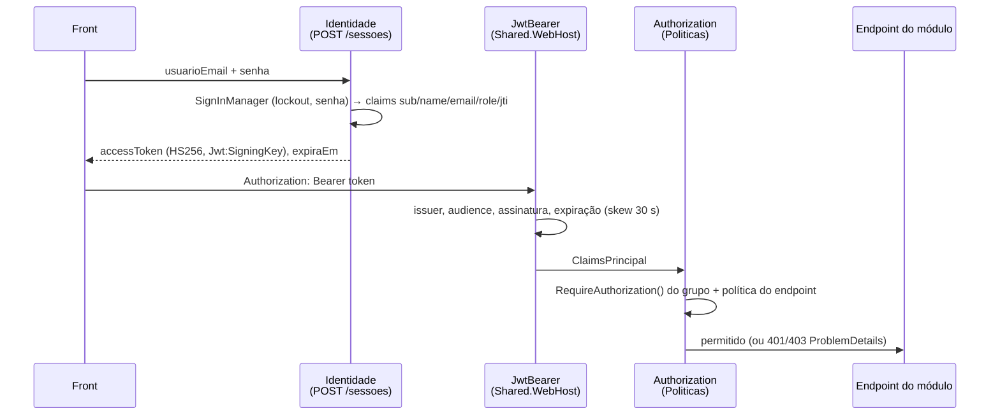

# Segurança

Segurança é resolvida uma vez em `Shared.WebHost` e herdada por todos os módulos. Este documento descreve o que existe no código, o que é responsabilidade do módulo Identidade (pela spec) e o que precisa ser feito antes de produção.

## 1. Autenticação: ASP.NET Core Identity + JWT próprio

- **Armazenamento e regras de senha** ficam no módulo Identidade (schema `Identidade`), com as classes do Identity sobrescritas para seguir as convenções do projeto: `Usuario : IdentityUser<Guid>` (tabela `Usuarios`), `Perfil : IdentityRole<Guid>` (`Perfis`), `UsuarioPerfil`, `UsuarioClaim`, `UsuarioLogin`, `UsuarioToken`, `PerfilClaim`. Política de senha: mínimo 8 caracteres, maiúscula, minúscula, dígito e símbolo; lockout após 5 tentativas por 5 minutos (spec).
- **Emissão do token** em `POST /api/v1/identidade/sessoes` (anônimo): JWT HS256 com claims `sub`, `name`, `email`, `role` (uma por perfil) e `jti`, expirando em `Jwt:ExpirationMinutes` (padrão 480). O login atualiza `UltimoAcessoEm` e emite `UsuarioAutenticado`.
- **Validação do token** em `Shared.WebHost.ModularWebHostExtensions.AdicionarSeguranca`: `ValidateIssuer`, `ValidateAudience`, `ValidateLifetime`, `ValidateIssuerSigningKey`, `ClockSkew = 30s`, `NameClaimType = ClaimTypes.Name`, `RoleClaimType = ClaimTypes.Role`, `MapInboundClaims = true`.
- **Chave**: `Jwt:SigningKey` com **ao menos 32 caracteres**; a aplicação lança `InvalidOperationException` na subida se a chave estiver ausente ou curta. A chave nunca fica em `appsettings.json` de produção: `appsettings.Development.json` traz uma chave de desenvolvimento explícita; no compose vem de `JWT_SIGNING_KEY` no `.env`.
- **Usuário corrente**: `ICurrentUser` (`Shared.Contracts.Common`) implementado por `CurrentUser` (singleton sobre `IHttpContextAccessor`, necessário porque o `AuditoriaSaveChangesInterceptor` é singleton para funcionar com DbContext pooling). Expõe `Id`, `Nome`, `Email`, `Perfis`, `PossuiPerfil`. É a fonte de `CriadoPor`/`AlteradoPor`/`ExcluidoPor` (nome, ou e-mail, ou `"sistema"` fora de requisição).

### Fluxo

## 2. Autorização: políticas

Definidas em `Shared.Contracts.Identidade.Politicas` e registradas em `AddAuthorizationBuilder`:

| Política | Regra | Uso típico |
|---|---|---|
| (padrão do grupo) | usuário autenticado | leituras (`GET`), inscrições e certificados |
| `Politicas.Gestao` | perfil `Administrador` **ou** `Organizador` | criar/alterar/excluir locais, pessoas, eventos, palestras; registrar presença |
| `Politicas.Administracao` | perfil `Administrador` | usuários e perfis, registros de auditoria |
| `AllowAnonymous()` | sem token | `POST /identidade/sessoes`, `GET /palestras/certificados/{codigo}`, `/health/*`, `/openapi/*`, `/swagger` |

`MapModuleGroup` aplica `RequireAuthorization()` a todo o grupo do módulo; um endpoint só é público se declarar `AllowAnonymous()` explicitamente. O `SegurancaOperationTransformer` reflete isso no Swagger (cadeado apenas nas operações protegidas).

Perfis padrão (`PerfisPadrao`): `Administrador`, `Organizador`, `Participante`; criados pelo seed do Identidade junto com o administrador inicial (`Identidade:AdministradorInicial`, criado apenas se não existir e apenas se houver senha configurada).

## 3. Rate limiting

`AdicionarRateLimiting`: limitador global de **janela fixa** particionado por `ctx.User.Identity?.Name` (usuário autenticado) ou, para anônimos, pelo IP remoto. Parâmetros `RateLimiting:PermitLimit` (300) e `RateLimiting:WindowSeconds` (60), `QueueLimit = 0`. Rejeição devolve `429` com `application/problem+json` (`Type` `.../erros/LimiteRequisicoes`).

Observações:

- O IP remoto depende de `UseForwardedHeaders` (habilitado para `X-Forwarded-For`/`X-Forwarded-Proto` com `KnownNetworks`/`KnownProxies` limpos, ou seja, confia no proxy à frente). Em produção coloque a API **somente** atrás do proxy (Caddy/Nginx/Container Apps ingress) e não a exponha diretamente.
- A spec pede um limite adicional e mais rígido para `POST /identidade/sessoes` (ex.: 10/min por IP); é responsabilidade do módulo Identidade (política nomeada de rate limiting no endpoint).

## 4. CORS

`Cors:AllowedOrigins` (array; padrão `http://localhost:5760` e `http://localhost:5761`), qualquer header e método, e expõe `X-Correlation-Id` e `Location` para o front ler. Não usa credenciais de cookie (o token vai no header). Em produção, liste apenas as origens reais do front.

## 5. Cabeçalhos e transporte

`SecurityHeadersMiddleware` adiciona em toda resposta: `X-Content-Type-Options: nosniff`, `X-Frame-Options: DENY`, `Referrer-Policy: no-referrer`, `Permissions-Policy: camera=(), microphone=(), geolocation=()` e remove `Server`. Fora de Development, `UseHsts()` está ligado. TLS termina no proxy (VPS) ou no ingress (Azure); o container escuta HTTP na 8080 como usuário não-root `app`.

## 6. Erros sem vazamento

- Erros de negócio: `Result` → ProblemDetails (`ResultHttpExtensions.ToProblem`) com `title`, `detail` (mensagem de negócio), `type` (`https://gestao-eventos.globalsys.com.br/erros/<codigo>`), `codigo` e `traceId` (adicionado por `CustomizeProblemDetails`).
- Validação: `ValidationFilter` → 400 `ValidationProblemDetails` com `errors` por propriedade e `codigo = Validacao`.
- Exceções: `GlobalExceptionHandler` → 500 (499 se cancelado), `detail` = mensagem da exceção **apenas em Development**; em produção, `"Ocorreu um erro inesperado. Informe o traceId ao suporte."`. Stack trace só nos logs.
- Npgsql: `Include Error Detail=true` está na connection string de **desenvolvimento**; não use em produção (pode expor valores de parâmetros em mensagens de erro).

## 7. Segredos e configuração

| Segredo | Como fornecer | Nunca |
|---|---|---|
| `Jwt__SigningKey` | variável de ambiente, `dotnet user-secrets` (dev), Key Vault / secret do orquestrador | commitar; reutilizar entre ambientes |
| `ConnectionStrings__GestaoEventos` | idem; em Azure, Managed Identity é preferível a senha | logar; colocar em URL |
| `Identidade__AdministradorInicial__Senha` | apenas na primeira subida de um ambiente; depois remover e trocar a senha | deixar o padrão `Admin@123456` fora de dev |
| `ApplicationInsights__ConnectionString` | variável de ambiente | tratar como público (permite ingestão indevida) |

`.env` está no `.gitignore`; `.env.example` documenta as chaves sem valores reais.

## 8. LGPD

Dados pessoais vivem em dois módulos e a documentação deixa isso explícito:

| Módulo | Dados pessoais | Finalidade | Base e cuidados |
|---|---|---|---|
| Pessoas | nome, e-mail, telefone, CPF (`PessoaDocumento`, só dígitos), empresa, cargo, minibio, URL de foto | identificar palestrantes e participantes, emitir certificados nominais | coletar apenas o necessário (campos opcionais são opcionais); `ObterPessoasResumoAsync` devolve só `Id`, `PessoaNome`, `PessoaEmail` aos outros módulos (minimização entre módulos) |
| Identidade | e-mail, nome, hash de senha, último acesso | autenticação e autorização | senha só como hash do Identity; lockout; JWT com expiração |
| Eventos / Palestras | apenas `PessoaId` | vínculo de inscrição, presença, certificado | não duplicam dados pessoais; nomes são resolvidos em tempo de leitura via `IPessoasModuleApi` |
| Auditoria | cópia de `DadosAnteriores`/`DadosNovos` de qualquer entidade auditada, `UsuarioId`, `UsuarioNome` | trilha de quem fez o quê, quando (accountability) | acesso restrito a `Politicas.Administracao`; **inclui dados pessoais de Pessoas/Identidade** quando essas entidades mudam; definir retenção e política de anonimização (não implementadas hoje) |

Práticas do código que ajudam: soft delete preserva a trilha mas remove o registro das consultas; `AuditoriaSaveChangesInterceptor` registra o usuário responsável em toda alteração; logs não serializam requests; `UsuarioId` no log de requisição é um Guid, não o e-mail.

Pendências a decidir com a área responsável antes de produção real: prazo de retenção de auditoria e logs, atendimento a pedido de exclusão (anonimizar `Pessoas` e purgar `DadosNovos` correlatos), e se `PessoaDocumento` é realmente necessário para o certificado.

## 9. Checklist de produção

- [ ] `Jwt__SigningKey` forte (≥ 32 caracteres aleatórios), única por ambiente, armazenada em cofre.
- [ ] `ASPNETCORE_ENVIRONMENT=Production` (desliga `EnableDetailedErrors`, `detail` de exceção e liga HSTS).
- [ ] Connection string sem `Include Error Detail=true`; usuário do banco com privilégios mínimos (ver [dados.md](dados.md)).
- [ ] `Identidade__AdministradorInicial__Senha` definida apenas na primeira subida; senha trocada em seguida; variável removida.
- [ ] `Cors__AllowedOrigins__*` restritas às origens reais do front.
- [ ] API atrás de proxy/ingress com TLS; porta 8080 não exposta publicamente; `X-Forwarded-*` enviados pelo proxy.
- [ ] `RateLimiting__*` ajustados à carga esperada; limite específico de login ativo no módulo Identidade.
- [ ] `Database__MigrateOnStartup=false` em produção com múltiplas réplicas ou alta criticidade; migrações em pipeline (ver [runbooks/migracoes-banco.md](../runbooks/migracoes-banco.md)).
- [ ] Exportação de telemetria configurada (`OTEL_EXPORTER_OTLP_ENDPOINT` ou `ApplicationInsights__ConnectionString`) e alertas em `usecase.failures`, `outbox.messages.failed`, 5xx.
- [ ] Backup do PostgreSQL testado (restauração incluída).
- [ ] Imagem atualizada regularmente (base `mcr.microsoft.com/dotnet/aspnet:10.0`) e varredura de vulnerabilidades no pipeline.
- [ ] Política de retenção de logs e auditoria definida e aplicada.
- [ ] Revisão por par de qualquer script executado em produção (política Globalsys).
